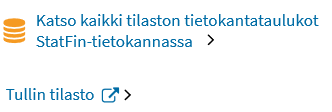
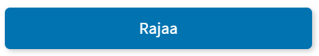

# Stat.fi Beta Design System

Sisällysluettelo:

[Typografia](#typografia)

[Kuvat](#kuvat)

[Ikonit](#ikonit)

[Värit](#värit)

[Sivupohja](#sivupohja)

[Komponentit](#komponentit)

## Typografia
Fontteina käytetään Googlen ilmaisia fontteja. 

[Otsikot](#otsikot)

[Leipäteksti](#leipäteksti)

[Ingressi](#ingressi)

[Introteksti](#introteksti)

[Yhteystiedot](#yhteystiedot)

### Otsikot
Fontti: Barlow

H1 Barlow, regular 34px

H2 Barlow, regular 28px

H3 Barlow, regular 22px

H4 Barlow, medium 16px

H5 Barlow, medium 14px
	
### Leipäteksti
Fontti: Source Sans Pro, regular 16px = 1rem

Font-family: Source Sans Pro, Arial, Verdana, Lucida, Helvetica, Sans-serif;
	
### Ingressi
Fontti: Barlow regular, 17px/1.255rem

### Introteksti
Aihe- ja ilmiö-sivuilla

Fontti: Barlow regular, 17px/1.255rem
	
### Yhteystiedot
Titteli: leipätekstin tyyli

Nimi: Source Sans Pro regular, 18px

Puhelinnumero: leipätekstin tyyli

## Kuvat
### Hero-kuvat
Mobiilissa hero-kuva ulottuu näytön laidasta laitaan. Mobiilinäytöllä näkyy täysikokoisesta kuvasta rajattu tietty kohta. (Kohta määritellään myöhemmin tarkemmin.)

Desktopissa hero-kuva ulottuu näytön laidasta laitaan kunnes kuvan koko tulee vastaan. Sen jälkeen kuvan vasemmalle ja oikealle puolelle tulee marginaalit. Kuva-alueen korkeus pysyy samana koko ajan ja kuva rajautuu korkeudesta näytön koon kasvaessa. 
	
Hero-kuviksi valitaan sellaisia, jotka toimivat monessa koossa. 

## Ikonit

Ikoneina käytetään (jo aiemmin käytössä olleita) Font Awesomen ja IcoMoonin ilmaisia ikonikirjastoja. 

## Värit
Väreinä käytetään Tilastokeskuksen väripalettia. (Värien kontrastitarkistusta pitää tehdä ja palettia päivittää!) 

## Sivupohja

[Navigaatiopalkki](#navigaatiopalkki)

[Megamenu](#megamenu)

[Sisältöalue](#sisältöalue)

[Tausta](#tausta)

[Blokit](#blokit)

[Footer](#footer)
	
### Navigaatio-palkki
#### Navigaatio-palkin tausta
Taustan väri: #0073b0
			
Navigaatio-palkin taustan leveys on näytön/selainikkunan laidasta laitaan 2500px asti. Siitä ylöspäin oikealle ja vasemmalle tulee marginaalit. 
*Poikkeus:* 
Jos ollaan sivulla, jossa on bannerikuva (aiheen ja tarkennetun aiheen sivuilla): navipalkin tausta on näytön laidasta laitaan kunnes bannerikuvan rajat tulevat vastaan: navipalkki loppuu siinä missä bannerikuvakin. 
			
#### Navigaatio-palkin sisältö
Fontti: Barlow medium, 1.1rem, valkoinen, pienaakkoset, ei alleviivausta 

Fontin padding-left ja padding-right: 1.5rem 

Fontin padding-top ja padding-bottom: 1.2rem 
			
Navigaatiopalkin painikkeiden välissä on ohuet 1px #338fc0 pystyviivat, viivojen korkeus sama kuin navipalkin korkeus. 
			
Navipalkin sisältöalue on leveydeltään 1200px eli sama kuin muukin sisältöalue. Navipalkin sisältö pysyy sisältöalueen sisällä, se ei leviä taustan mukana näytön koon kasvaessa. Navipalkin sisältö on samassa linjassa sivun muun sisällön kanssa eli alkaa vasemmassa laidassa samasta kohdasta kuin sivuston muukin sisältö. 

Navipalkin sisällön tasaus: vasen. Sisältö ei levity tasaisesti koko navipalkin alueelle vaan pysyy vasemmassa laidassa. 

### Megamenu
Megamenun sisältö keskitetty vasempaan laitaan. 
Megamenujen sisällöissä (linkeissä) alleviivaus. 

### Sisältöalue
Pikseleistä lasketaan rem-arvot tai %-osuudet. 
		
Sisältöalueen sisältö on tasattu vasemmalle. 
	
**Desktop:**

Sisältöalueen leveys: 1200px

Sisältöalue on jaettu desktopissa maksimissaan kolmeen palstaan. 
		
**Mobiili:**

Mobiilissa on vain yksi palsta. Desktopin kolme palstaa asettuvat responsiivisesti allekkain näytön/selainikkunan pienentyessä. 

### Tausta
Koko sivuston background: valkoinen, 2% musta
	
### Tekstipalsta
**Desktop:**

Tekstipalstan leveys: 555px

**Mobiili:**

### Blokit
Taustaväri: valkoinen, 2% musta

**Desktop:**

Marginaali: 40px; 2.5rem

Padding: 40px; 2.5rem

**Mobiili:**

Marginaali: noudattaa toistaiseksi desktopin marginaaleja. 

Padding-top ja padding-bottom: puolet desktopin paddingista. 

Padding-left ja padding-right: 1/4 desktopin paddingista. 

### Footer
Footerin tausta ulottuu aina laidasta laitaan, sekä isoissa että pienissä näytöissä/selainikkunoissa. 
Isoissa desktop-näytöissä 2500px leveyteen asti koko näytön levyinen, siitä ylöspäin tulee marginaalit. Eli footerin tausta käyttäytyy deskarissa kuten yläpalkin ja navipalkin tausta. 
	
Footerin sisältöalue on leveydeltään 1200px eli sama kuin muukin sisältöalue. 
	
Footerin tausta: #0073b0 

Footerin linkit noudattavat linkkityylejä. 
		
Neljä palstaa: ensimmäisessä Tilastokeskuksen logo, kolme muuta linkkipalstoja. Tarvittaessa näytön/selainikkunan pienentyessä palstat hyppäävät kokonaan toiselle riville ensimmäisen rivin palstojen alle. 

## Komponentit

[Jakoviiva](#jakoviiva)

[Haitari](#haitari)

[Kuviot](#kuviot)

[Laajennuspaneeli](#laajennuspaneeli)

[Linkit](#linkit)

[Murupolku](#murupolku)

[Painikkeet](#painikkeet)

[Pudotusvalikot](#pudotusvalikot)

[Pääkohdat](#pääkohdat)

[Tagit](#tagit)

[Taulukot](#taulukot)

[Videot](#videot)

### Jakoviiva
Ensisijaisesti eri osioiden erottamiseen toisistaan tulee käyttää tyhjää tilaa. Niissä tilasteissa, joissa tyhjää tilaa ei voida käyttää, käytetään jakoviivoja.  

Leveys: 1px

Väri: #aaaaaa

Jakoviivoja voidaan käyttää asioiden ryhmittelyyn asettamalla niitä eri ryhmien väliin, esim menuissa. 

Jakoviivoilla voidaan myös erottaa saman kokonaisuuden/toisiinsa liittyviä asioita toisistaan. 

### Haitari 

Haitari-rakenteella saadaan lyhennetty sivun pituutta. Haitarin sisällön tulee muodostaa yhtenäinen kokonaisuus. 

Haitari on enintään kaksi tasoa syvä. Sisempi taso on sisennetty ensimmäisen alle, tällä ilmaistaan haitarin hierarkinen rakenne. Suljettujen kohtien kohdalla on plus-ikoni, joka muuttuu miinus-ikoniksi kun kohta avataan. Avatun kohdan alle tulee jakoviiva. 

Plus-ja miinus-ikonit ovat suurempia ja tummempia ensimmäisellä tasolla ja pienempiä ja vaaleampia syvemmällä tasolla. Myös tällä kerrotaan visuaalisesti hierarkiasta. 

**Ensimmäisen tason ikonit:**

Korkeus: 15px 

Leveys: 15px

Väri: #0073b0

**Toisen tason ikonit**

Korkeus: 11px

Leveys: 11px

Väri: #338FC0

### Kuviot
Otsikon fontti: H4-tyyli

### Laajennuspaneeli 
(Eng. expansion panel)

Esim. Videon käsikirjoitus -laajennuspaneeli

Fontti: Source Sans Pro, regular 16px
	
### Linkit

Kaikki linkit toimivat näppäimistökäytössä vain enterillä. 

**Tavallinen linkki**

Fontti: leipätekstin tyyli, ei alleviivausta (paitsi tekstin seassa olevilla linkeillä!). 

Fontin väri: #006CA5;

**Negatiivi**

Negatiivinen linkki on linkki tummalla taustalla. 

Fontin väri: valkoinen

Ikonien väri: valkoinen

**Hover-tila**

Fontin väri: #0039a6;

Fontti: alleviivattu

Kursori muuttuu kädeksi linkin päällä. 

**Visited-tila**

Fontin väri: #551A8B;

Negatiivisella linkillä ei ole visited-väriä. 

**Focus-tila**

Fontin väri: #0039a6;

Fontti: alleviivattu

Reunus: 2px #0073b0;

#### Tekstin seassa

Tekstin seassa, eli p-elementin sisällä, olevat linkit alleviivataan aina. Muissa linkeissä ei ole alleviivausta.  

Fontti: leipätekstin tyyli, alleviivattu. 

#### Linkit ikonilla

Ikoni tulee tavallisesti linkin eteen ja on samanvärinen kuin linkin teksti (paitsi brändätyt ikonit? StatFin? to-be-updated). Ikoni on osa linkkiä. 

Yksittäisessä erillään olevassa linkissä linkin perässä oleva nuoli korostaa, että linkistä tapahtuu jotain. Nuoli on aina linkin perässä. Nuoli-ikoni ei ole osa linkkiä, siitä klikkaamalla ei tapahdu mitään. 

Nuoli-ikonin väri: musta. 

Linkeillä voi olla myös kaksi ikonia. Ikonit ovat silloin omilla paikoillaan ja ne saattavat asettua linkkitekstin molemmille puolille tai peräkkäin. 

#### Navigaatiolinkit

(Navigaatiolinkit esim. menussa, navipalkissa, footerissa ym.: ei alleviivausta eikä nuolta/bulletia.)

#### Ulkoinen linkki:

Linkin perässä on ulkoisen linkin ikoni. Ikoni on osa linkkiä. Linkin tekstissä tulee kertoa, että linkki vie toiseen palveluun. 

### Murupolku
Murupolun viimeinen kohta ei ole linkki. Muut kohdat ovat ja ne noudattavat tavallisen linkin tyylejä.  
	
Fontti: H5-tyylit. Semanttisesti ei H5-tason otsikko vaan navigaatio-elementti. 
	
**Desktop:** 

Kaikki tasot näkyvissä: 

Etusivu >  Liikenne ja matkailu >  Suomalaisten matkailu > Tilastojulkistus
	
**Mobiili:**

Korkealla sivuston hierarkian tasolla näytetään normaali murupolku: 

Etusivu > Liikenne ja matkailu

Syvän hierarkian tasolla murupolussa näytetään vain linkki edelliselle tasolle. Esim. tilastojulkistus-sivun murupolussa näkyy linkki tilaston sivulle: 

< Suomalaisten matkailu

### Painikkeet

### Pudotusvalikot 

(Eng. dropdown)

Pudotusvalikoilla on aina label. 

#### Yhden valinnan:

#### Useamman valinnan (multi select):	

### Pääkohdat

Pääkohdat, esim. tilastojulkistuksen sivulla. 

Fontti: ingressi-tyyli, #00B2A9

Sisennys: riippuva sisennys eli teksti sisentyy palleron oikealle puolelle, kaikki rivit samassa linjassa. 

Pallon väri: #00B2A9

Vasen pystyviiva: #00B2A9. Pystyviivaa ei ole mobiilissa.

### Tagit

#### Tyyppi-tagi
= Tyyppitagi Tilasto-, Tilastojulkistus- ja Muutoksia tässä tilastossa -sivujen yläosassa. 

Fontti: Barlow medium 14px, #333333

### Taulukot
Otsikon fontti: H4-tyyli
Fontti: Barlow Semi Condensed regular

Sarake- ja riviotsikoiden fonttityyli: Barlow Semi Condensed SemiBold

Solun padding-left ja padding-right: 10px

Solun padding-top ja padding-bottom: 8px

### Videot
Otsikon fontti: H4-tyyli

	

