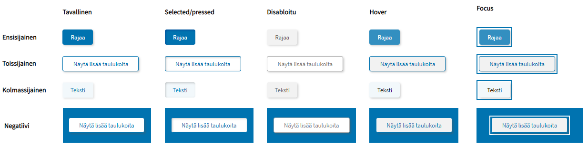
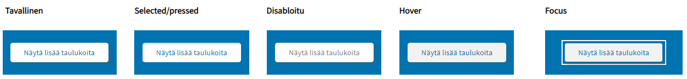
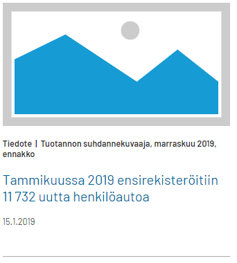
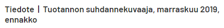

# Beta Design System <!-- omit in toc -->

## Sisällysluettelo <!-- omit in toc -->
- [Typografia](#typografia)
- [Kuvat](#kuvat)
  - [Hero-kuva](#hero-kuva)
- [Ikonit](#ikonit)
- [Värit](#v%c3%a4rit)
- [Sivupohja](#sivupohja)
  - [Navigaatio-palkki](#navigaatio-palkki)
  - [Megamenu](#megamenu)
  - [Sisältöalue](#sis%c3%a4lt%c3%b6alue)
  - [Sivuston tausta](#sivuston-tausta)
  - [Tekstipalsta](#tekstipalsta)
  - [Blokit](#blokit)
  - [Footer](#footer)
- [Komponentit](#komponentit)
  - [Jakoviiva](#jakoviiva)
  - [Haitari](#haitari)
    - [Haitarin ikonien tyylit](#haitarin-ikonien-tyylit)
  - [Laajennuspaneeli](#laajennuspaneeli)
  - [Linkki](#linkki)
    - [Sisäinen linkki](#sis%c3%a4inen-linkki)
      - [Tavallinen linkki](#tavallinen-linkki)
      - [Negatiivi-linkki](#negatiivi-linkki)
      - [Linkki tekstin seassa](#linkki-tekstin-seassa)
      - [Linkki ikonilla](#linkki-ikonilla)
    - [Ulkoinen linkki](#ulkoinen-linkki)
  - [Murupolku](#murupolku)
  - [Painike](#painike)
    - [Koko](#koko)
    - [Ensisijainen painike](#ensisijainen-painike)
    - [Toisijainen painike](#toisijainen-painike)
    - [Kolmassijainen painike](#kolmassijainen-painike)
    - [Negatiivi-painike](#negatiivi-painike)
  - [Pudotusvalikko](#pudotusvalikko)
    - [Yhden valinnan pudotusvalikko](#yhden-valinnan-pudotusvalikko)
    - [Useamman valinnan (multi select)	pudotusvalikko](#useamman-valinnan-multi-select-pudotusvalikko)
    - [Pudotusvalikoiden saavutettavuus](#pudotusvalikoiden-saavutettavuus)
  - [Pääkohdat](#p%c3%a4%c3%a4kohdat)
  - [Tagit](#tagit)
  - [Tilastokuviot](#tilastokuviot)
    - [Kaikille kuviotyypeille yhteiset tyylit](#kaikille-kuviotyypeille-yhteiset-tyylit)
    - [Kuvioiden saavutettavuus](#kuvioiden-saavutettavuus)
    - [Viivakuvio](#viivakuvio)
    - [Piirakkakuvio](#piirakkakuvio)
    - [Pylväskuvio](#pylv%c3%a4skuvio)
    - [Kuvion tooltip](#kuvion-tooltip)
  - [Tilastotaulukko](#tilastotaulukko)
    - [Taulukon saavutettavuus](#taulukon-saavutettavuus)
    - [Taulukko pienillä näytöillä](#taulukko-pienill%c3%a4-n%c3%a4yt%c3%b6ill%c3%a4)
    - [Taulukko isoilla näytöillä](#taulukko-isoilla-n%c3%a4yt%c3%b6ill%c3%a4)
    - [Taulukon tyylit](#taulukon-tyylit)
  - [Video](#video)
    - [Koko](#koko-1)
    - [Videoiden saavutettavuus](#videoiden-saavutettavuus)

## Typografia
Fontteina käytetään Googlen ilmaisia fontteja. Vaikka osa fonttien ko'oista on tässä ilmoitettu pikseleinä, ne tulee toteuttaa suhteellisina arvoina (em tai rem). 

| Taso                | Font                     | Font-size     | Font-family                                                    | Color   |
| ------------------- | ------------------------ | ------------- | -------------------------------------------------------------- | ------- |
| Leipäteksti         | Source Sans Pro, regular | 16px/1rem     | Source Sans Pro, Arial, Verdana, Lucida, Helvetica, Sans-serif |         |
| Leipäteksti, iso    | Source Sans Pro, regular | 18px          |                                                                |         |
| H1                  | Barlow, regular          | 34px          |                                                                |         |
| H2                  | Barlow, regular          | 28px          |                                                                |         |
| H3                  | Barlow, regular          | 22px          |                                                                |         |
| H4                  | Barlow, medium           | 16px          |                                                                |         |
| H5                  | Barlow, medium           | 14px          |                                                                |         |
| Ingressi            | Barlow regular           | 17px/1.255rem |                                                                |         |
| Introteksti         | Barlow, medium           | 14px          |                                                                |         |
| Päiväys/kirjoittaja | Barlow, regular          | 14px          |                                                                |         |
| Tyyppitagit         | Barlow, semibold         | 14px          |                                                                | #333333 |

## Kuvat
### Hero-kuva
Mobiilissa hero-kuva ulottuu näytön laidasta laitaan. Mobiilinäytöllä näkyy täysikokoisesta kuvasta rajattu tietty kohta. (Kohta määritellään myöhemmin tarkemmin.)

Desktopissa hero-kuva ulottuu näytön laidasta laitaan kunnes kuvan koko tulee vastaan. Sen jälkeen kuvan vasemmalle ja oikealle puolelle tulee marginaalit. Kuva-alueen korkeus pysyy samana koko ajan ja kuva rajautuu korkeudesta näytön koon kasvaessa. 
	
Hero-kuviksi valitaan sellaisia, jotka toimivat monessa koossa. 

## Ikonit

Ikoneina käytetään (jo aiemmin käytössä olleita) Font Awesomen ja IcoMoonin ilmaisia ikonikirjastoja. 

## Värit
Väreinä käytetään Tilastokeskuksen väripalettia. (Värien kontrastitarkistusta pitää tehdä ja palettia päivittää!) 

## Sivupohja
	
### Navigaatio-palkki
| Max-width | Sisältöalueen leveys | Background-color |
| --------- | -------------------- | ---------------- |
| 2500px    | 1200px               | #0073b0          |

Navigaatio-palkin taustan leveys on näytön/selainikkunan laidasta laitaan 2500px asti. Siitä ylöspäin navipalkin oikealle ja vasemmalle puolelle tulee marginaalit. 
*Poikkeus:* 
Jos ollaan sivulla, jossa on bannerikuva (aiheen ja tarkennetun aiheen sivuilla): navipalkin tausta on näytön laidasta laitaan kunnes bannerikuvan rajat tulevat vastaan: navipalkki loppuu siinä missä bannerikuvakin. 

Navipalkin sisältöalue on leveydeltään 1200px eli sama kuin muukin sisältöalue. Navipalkin sisältö pysyy sisältöalueen sisällä, se ei leviä taustan mukana näytön koon kasvaessa. Navipalkin sisältö on samassa linjassa sivun muun sisällön kanssa eli alkaa vasemmassa laidassa samasta kohdasta kuin sivuston muukin sisältö. 

| Font          | Font-size | Color   | Font-variant | Text-decoration | Padding                                                                      |
| ------------- | --------- | ------- | ------------ | --------------- | ---------------------------------------------------------------------------- |
| Barlow medium | 1.1rem    | #ffffff | normal       | none            | padding-left ja padding-right: 1.5rem, padding-top ja padding-bottom: 1.2rem |
			
Navigaatiopalkin painikkeiden välissä on ohuet pystyviivat, viivojen korkeus sama kuin navipalkin korkeus: 
| Width | Color   |
| ----- | ------- |
| 1px   | #338fc0 |

Navipalkin sisällön tasaus: vasen. Sisältö ei levity tasaisesti koko navipalkin alueelle vaan on tasattu sisältöalueen vasempaan laitaan. 

### Megamenu
Megamenun sisältö keskitetty vasempaan laitaan.  

### Sisältöalue
Pikseleistä lasketaan rem-arvot tai %-osuudet. 

|             | Leveys | Palstoja max | Sisällön tasaus |
| ----------- | ------ | ------------ | --------------- |
| **Desktop** | 1200px | 3            | vasen           |
| **Mobiili** |        | 1            | vasen           |

Sisältöalueen maksimileveys desktopissa on 1200px. Sisältöalueen sisältö on tasattu vasemmalle. Sisältöalue on jaettu desktopissa maksimissaan kolmeen palstaan ja mobiilissa yhteen palstaan. Desktopin kolme palstaa asettuvat responsiivisesti allekkain näytön/selainikkunan pienentyessä. 

### Sivuston tausta
| Background|
| ----- |
| valkoinen, 2% musta |

	
### Tekstipalsta
|             | Width |
| ----------- | ----- |
| **Desktop** | 555px |
| **Mobiili** |       |

### Blokit
|             | Background-color    | Margin        | Padding                                                                                                                                |
| ----------- | ------------------- | ------------- | -------------------------------------------------------------------------------------------------------------------------------------- |
| **Desktop** | valkoinen, 2% musta | 2.5rem (40px) | 2.5rem (40px)                                                                                                                          |
| **Mobiili** | valkoinen, 2% musta | 2.5rem (40px) | **Padding-top** ja **padding-bottom**: puolet desktopin paddingista. **Padding-left** ja **padding-right**: 1/4 desktopin paddingista. |

### Footer 

| Max-width | Sisältöalueen leveys | Background-color |
| --------- | -------------------- | ---------------- |
| 2500px    | 1200px               | #0073b0          |
		
Footerin tausta ulottuu aina laidasta laitaan, sekä isoissa että pienissä näytöissä/selainikkunoissa. 
Isoissa desktop-näytöissä 2500px leveyteen asti koko näytön levyinen, siitä ylöspäin tulee marginaalit. Eli footerin tausta käyttäytyy deskarissa kuten yläpalkin ja navipalkin tausta. 
	
Footerin sisältöalue on leveydeltään 1200px eli sama kuin muukin sisältöalue.

Neljä palstaa: ensimmäisessä Tilastokeskuksen logo, kolme muuta linkkipalstoja. Tarvittaessa näytön/selainikkunan pienentyessä palstat hyppäävät kokonaan toiselle riville ensimmäisen rivin palstojen alle. 

## Komponentit

### Jakoviiva
Ensisijaisesti eri osioiden erottamiseen toisistaan tulee käyttää tyhjää tilaa. Niissä tilasteissa, joissa tyhjää tilaa ei voida käyttää, käytetään jakoviivoja.  

| Height | Color   |
| ------ | ------- |
| 1px    | #aaaaaa |

Jakoviivoja voidaan käyttää asioiden ryhmittelyyn asettamalla niitä eri ryhmien väliin, esim menuissa. 

Jakoviivoilla voidaan myös erottaa saman kokonaisuuden/toisiinsa liittyviä asioita toisistaan. 

### Haitari 

Haitari-rakenteella saadaan lyhennetty sivun pituutta. Haitarin sisällön tulee muodostaa yhtenäinen kokonaisuus. 

Haitari on enintään kaksi tasoa syvä. Sisempi taso on sisennetty ensimmäisen alle, tällä ilmaistaan haitarin hierarkinen rakenne. Suljettujen kohtien kohdalla on plus-ikoni, joka muuttuu miinus-ikoniksi kun kohta avataan. Avatun kohdan alle tulee jakoviiva. 

Plus-ja miinus-ikonit ovat suurempia ja tummempia ensimmäisellä tasolla ja pienempiä ja vaaleampia syvemmällä tasolla. Myös tällä kerrotaan visuaalisesti hierarkiasta. 

#### Haitarin ikonien tyylit

| Hierarkiataso | Height | Width | Color    |
| ------------- | ------ | ----- | -------- |
| Ensimmäinen   | 15px   | 15px  | #0073b0  |
| Toinen        | 11px   | 11px  | #338FC0F |

### Laajennuspaneeli 
(Eng. expansion panel)

Esim. Videon käsikirjoitus -laajennuspaneeli

| Font | 
| ---------- | 
| Leipäteksti    | 
	
### Linkki

Kaikki linkit toimivat näppäimistökäytössä vain enterillä. 

#### Sisäinen linkki

##### Tavallinen linkki

| Tila           | Font        | Text-decoration | Color   | Muuta                                 |
| -------------- | ----------- | --------------- | ------- | ------------------------------------- |
| **Tavallinen** | Leipäteksti | none            | #006CA5 |                                       |
| **Hover**      |             | underline       | #0039a6 | Kursori muuttuu kädeksi linkin päällä |
| **Focus**      |             | underline       | #0039a6 | Reunus: 2px, #0073b0                  |
| **Vierailtu**  |             | none            | #551A8B |                                       |

Tavallinen-tila:

Hover-tila:

Focus-tila:

Vierailtu-tila:

##### Negatiivi-linkki

Negatiivi-linkki on linkki tummalla taustalla. Tumman taustan vuoksi sen tyylit eri tiloissa eroavat tavallisesta linkistä hieman. 

| Tila           | Font        | Text-decoration | Color   | Muuta                                 |
| -------------- | ----------- | --------------- | ------- | ------------------------------------- |
| **Tavallinen** | Leipäteksti | none            | #ffffff |                                       |
| **Hover**      |             | underline       | #ffffff | Kursori muuttuu kädeksi linkin päällä |
| **Focus**      |             | underline       | #ffffff | Reunus: 2px, #ffffff                  |
| **Vierailtu**  |             | none            | #ffffff |                                       |

Tavallinen-tila:

Hover-tila:

Focus-tila:

Vierailtu-tila:

##### Linkki tekstin seassa

Tekstin seassa, eli p-elementin sisällä, olevat linkit alleviivataan aina. Muissa linkeissä ei ole alleviivausta. 

| Tila           | Font        | Text-decoration |
| -------------- | ----------- | --------------- |
| **Tavallinen** | Leipäteksti | underline       |

##### Linkki ikonilla

Ikoni tulee linkin eteen (poikkeuksena ulkoinen linkki, jossa ikoni tulee tekstin jälkeen) ja on samanvärinen kuin linkin teksti. Ikoni on osa linkkiä. 

Yksittäisessä erillään olevassa linkissä linkin perässä oleva nuoli korostaa, että linkistä tapahtuu jotain. Nuoli on aina linkin perässä. Nuoli-ikoni ei ole osa linkkiä, siitä klikkaamalla ei tapahdu mitään. 

Linkeillä voi olla myös kaksi ikonia. Ikonit asettuvat silloin joko linkkitekstin molemmille puolille. 

| Ikoni                | Color   |
| -------------------- | ------- |
| **Nuoli**            | #0073b0 |
| **StatFin/database** | #f59a23 |
| **Muu**              | #000000 |
| **Negatiivi**        | #ffffff |

#### Ulkoinen linkki

Ulkoiseen palveluun vievän linkin perässä on ulkoisen linkin ikoni. Tämä ikoni on osa linkkiä. Linkin tekstissä tulee kertoa, että linkki vie toiseen palveluun. 

### Murupolku

 Murupolun osat viimeistä lukuunottamatta ovat linkkejä ja ne noudattavat H5-otsikkotason fonttia sekä tavallisen linkin tyyliä. Murupolun viimeinen kohta ei ole linkki. 
 
 Osiot erotetaan toisistaan /-merkillä. 
	
Vaikka murupolku noudattaa H5-tason fonttia, se ei ole semanttisesti H5-tason otsikko vaan navigaatio-elementti. 

| Murupolun osa | Font           | Font-size | Color   | Text-decoration |
| ------------- | -------------- | --------- | ------- | --------------- |
| Linkki        | Barlow, medium | 14px      | #006ca5 | none            |
| Viimeinen     | Barlow, medium | 14px      | #000000 | none            |

Murupolku käyttäytyy desktopissa ja mobiilissa hieman eri tavoin. 

**Murupolku desktopissa**

Desktopissa näytetään murupolussa kaikki tasot: 

	
**Murupolku mobiilissa**

Mobiilissa matalilla sivuston hierarkian tasoilla (n. kaksi ensimmäistä tasoa) näytetään normaali murupolku: 

Syvämmällä hierarkian tasoilla murupolussa näytetään vain linkki yhtä tasoa hierarkiassa ylemmäs. Näin estetään murupolun rivittyminen mobiilissa. Esim. tilastojulkistus-sivun murupolussa näkyy vain linkki tilaston sivulle:

|                                             | Murupolun muoto                                                    |
| ------------------------------------------- | ------------------------------------------------------------------ |
| **Desktop**                                 | Tilastotieto / Suomalaisten matkailu / Tilastojulkistus / Taulukko |
| **Mobiili (matalilla hierarkian tasoilla)** | Tilastotieto / Suomalaisten matkailu                               |
| **Mobiili (syvillä hierarkian tasoilla)**   | < Tilastojulkistus                                                 |

### Painike

#### Koko

Mobiilissa painikkeet ovat täysleveitä lukuunottamatta niiden oikealle ja vasemmalle puolelle jääviä marginaaleja. Isoilla näytöillä eli desktopissa painikkeiden leveys taas skaalautuu sisällön mukaan. Minimi-leveys painikkeille on kuitenkin 80px. 

**Painikkeiden yhteiset ominaisuudet**
| Font                     | Font-size | Border-radius | Min-width | Min-height | Focus-kehys  |
| ------------------------ | --------- | ------------- | --------- | ---------- | ------------ |
| Source Sans Pro, regular | 16px/1rem | 5px           | 80px      | 40px       | 2px, #0073b0 |

#### Ensisijainen painike

| Tila                 | Color   | Background-color | Border | Box-shadow                              |
| -------------------- | ------- | ---------------- | ------ | --------------------------------------- |
| **Tavallinen**       | #ffffff | #0073b0          | -      | 2px, 2px, 5px, rgba(102,102,102,0.35)   |
| **Selected/pressed** | #ffffff | #0073b0          | -      | 2px, 2px, 5px, rgba(5,3,112,0.35) inset |
| **Disabled**         | #666666 | #f2f2f2          | -      | 2px, 2px, 5px, rgba(102,102,102,0.35)   |
| **Hover**            | #ffffff | #338fc0          | -      | 2px, 2px, 5px, rgba(102,102,102,0.35)   |
| **Focus**            | #ffffff | #338fc0          | -      | 2px, 2px, 5px, rgba(102,102,102,0.35)   |

#### Toisijainen painike

| Tila                 | Color   | Background-color | Border  | Box-shadow                                  |
| -------------------- | ------- | ---------------- | ------- | ------------------------------------------- |
| **Tavallinen**       | #0073b0 | #ffffff          | #0073b0 | 2px, 2px, 5px, rgba(102,102,102,0.35)       |
| **Selected/pressed** | #0073b0 | #ffffff          | #0073b0 | 2px, 2px, 5px, rgba(102,102,102,0.35) inset |
| **Disabled**         | #7f7f7f | #ffffff          | #aaaaaa | 2px, 2px, 5px, rgba(102,102,102,0.35)       |
| **Hover**            | #0073b0 | #f2f2f2          | #0073b0 | 2px, 2px, 5px, rgba(102,102,102,0.35)       |
| **Focus**            | #0073b0 | #f2f2f2          | #0073b0 | 2px, 2px, 5px, rgba(102,102,102,0.35)       |

#### Kolmassijainen painike

| Tila                 | Color   | Background-color | Border | Box-shadow                                  |
| -------------------- | ------- | ---------------- | ------ | ------------------------------------------- |
| **Tavallinen**       | #0073b0 | #f2f8fb          | -      | 2px, 2px, 5px, rgba(102,102,102,0.35)       |
| **Selected/pressed** | #0073b0 | #f2f8fb          | -      | 2px, 2px, 5px, rgba(102,102,102,0.35) inset |
| **Disabled**         | #666666 | #f2f2f2          | -      | 2px, 2px, 5px, rgba(102,102,102,0.35)       |
| **Hover**            | #000000 | #f2f8fb          | -      | 2px, 2px, 5px, rgba(102,102,102,0.35)       |
| **Focus**            | #000000 | #f2f8fb          | -      | 2px, 2px, 5px, rgba(102,102,102,0.35)       |

#### Negatiivi-painike

| Tila                 | Color   | Background-color | Border  | Box-shadow                                  |
| -------------------- | ------- | ---------------- | ------- | ------------------------------------------- |
| **Tavallinen**       | #0073b0 | #ffffff          | #0073b0 | 4px, 4px, 5px, rgba(85,85,85,0.35)          |
| **Selected/pressed** | #0073b0 | #ffffff          | #0073b0 | 2px, 2px, 5px, rgba(102,102,102,0.35) inset |
| **Disabled**         | #7f7f7f | #ffffff          | #aaaaaa | 4px, 4px, 5px, rgba(85,85,85,0.35)          |
| **Hover**            | #0073b0 | #f2f2f2          | #0073b0 | 4px, 4px, 5px, rgba(85,85,85,0.35)          |
| **Focus**            | ?       | ?                | ?       | ?                                           |

### Pudotusvalikko
(Eng. dropdown)

Mobiili-käyttöliittymissä käytetään käyttöjärjestelmien valmiita pudotusvalikkojen toteutusratkaisuja. 

Pudotusvalikoita on kahdenlaisia, niitä mistä valitaan valikon vaihtoehdoista yksi ja niitä, joissa voidaan valita useampi. 

#### Yhden valinnan pudotusvalikko

Pudotusvalikon kentässä näkyy mikä valikon valinnoista on valittuna. Valikon kenttää klikkaamalla valikko avautuu. 

Tavallisessa pudotusvalikossa voi tehdä vain yhden valinnan. Vaihtoehdon valinta sulkee valikon. Tehty valinta tulee näkyviin pudotusvalikon kenttään. 

Jos pudotusvalikossa valintavaihtoehtoja on yli 14, valikko ei veny pituutta vaan valikosta tulee pystysuunnassa vieritettävä. Valikon oikeaan laitaan tulee näkyviin scrollbar. 

Jos valintavaihtoehtoja on yli 20, valikon sisään on hyvä lisätä hakutoiminnallisuus ja hakukenttä. Näin käyttäjät voivat hakea valikosta haluamaansa vaihtoehtoa nopeasti. 

#### Useamman valinnan (multi select)	pudotusvalikko

#### Pudotusvalikoiden saavutettavuus

Pudotusvalikon yläpuolella on sen nimike eli label. Label kertoo lyhyesti mitä pudotusvalikko sisältää. Ruudunlukijaa käyttäville kerrotaan pudotusvalikon status eli onko valikko kiinni vai auki. Ruudunlukijaa käyttäville kerrotaan myös mikä tai mitkä valikon valinnoista on valittuna.

### Pääkohdat

Pääkohdat, esim. tilastojulkistuksen sivulla. 

Fontti: ingressi-tyyli, #00B2A9

Sisennys: riippuva sisennys eli teksti sisentyy palleron oikealle puolelle, kaikki rivit samassa linjassa. 

Pallon väri: #00B2A9

Vasen pystyviiva: #00B2A9. Pystyviivaa ei ole mobiilissa.

### Tagit

Tageja käytetään antamaan julkaisuista lisää tietoa. Ne sijaitsevat otsikon yläpuolella tilastojen ja julkaisujen sivuilla sekä julkaisujen nostoelementeissä. 

Tagit antavat lisätietoa julkaisun ja sivun: 
* sisältötyypistä: tilasto, tilastojulkistus, taulukko, kuvio, indikaattori, artikkeli, blogi, video, katsaus, muutoksia tässä tilastossa, jne.   
* mihin tilastoon julkaisu kuuluu,
* mitä viiteajankohtaa tilastojulkistus käsittelee, 
* mikä on tilastojulkistuksen status: ennakko, pikaennakko, lopullinen jne. 
* mihin domainiin/palveluun julkaisu kuuluu, jos se kuuluu muuhun kuin stat.fi-domainiin: Findikaattori, Tieto&trendit. 
 
Huom! Tageilla ei merkitä julkaisupäivämäärää, sitä varten on oma elementtinsä. 

Tageja voi olla julkaisujen nostoelementeissä useampi peräkkäin. Esimerkiksi tilastojulkistuksen nostoelementissä on julkaisun tyyppi, tilasto, viiteajankohta ja julkaisun status. Julkaisun sisältötyyppi erotetaan muista tageista |-merkillä. 

Julkaisujen sivuilla on vain sivun sisältötyyppi-tagi, esimerkiksi tilastojulkistuksen sivulla Tilastojulkistus. Muita tageja ei ole tarpeen toistaa, sillä niiden tiedot esitetään sivulla muissa kohdissa. 

Silloin kun nostoelementtien linkki vie ulkoiseen palveluun, käytetään ulkoisen linkin ikonia tagissa mukana. Ulkoisen linkin ikoni laitetaan domainin nimen perään. 

**Tagien tyyli** 

|                        | Font             | Font-size | Color   |
| ---------------------- | ---------------- | --------- | ------- |
| Tagit            | Barlow, semibold | 14px      | #333333 |
| Ulkoinen linkki -ikoni |                  |           | #333333 |

### Tilastokuviot

#### Kaikille kuviotyypeille yhteiset tyylit

**Fontit**

|                | Font                          | Font-size   | Text-align |
| -------------- | ----------------------------- | ----------- | ---------- |
| **Otsikko**    | Barlow Semi Condensed medium  | 1rem (16px) | center     |
| **Alaotsikko** | Barlow Semi Condensed regular | 1rem (16px) | center     |
| **Muu teksti** | Barlow Semi Condensed regular | 1rem (16px) |            |

**Hilaviivat**

| Color   | Width  |
| ------- | ------ |
| #666666 | 0.25px |

**Akselit**

|              | Color   | Width | Akselin otsikon sijainti                   |
| ------------ | ------- | ----- | ------------------------------------------ |
| **y-akseli** | #666666 | 0.5px | Akseliviivan keskellä, eli nykyinen paikka |
| **x-akseli** | #666666 | 0.5px | Akseliviivan keskellä, eli nykyinen paikka |

#### Kuvioiden saavutettavuus

Suositus on, että kuvioon ei laiteta liikaa sisältöä. Tällöin kuvio pysyy helpommin ymmärrettävänä ja värisävyjen kontrastit riittävät harmaan sävyisinäkin (täyden värisokeuden tapaus). Jos sisältöä on paljon, on parempi jakaa sisältö useaan eri kuvioon. 

Tekstivastineita (alt-tekstiä) ei ole mahdollista tehdä kaikille kuvioille, koska niitä on niin paljon. Tämän vuoksi kuviot piilotetaan ruudunlukijalta. Tällöin ruudunlukija ei lue kuvioiden otsikoitakaan. Kuvioiden sisältö tulee kuitenkin tarjota sivulla tekstimuodossa, jotta myös ruudunlukijaa käyttävät saavat kuvioiden sisältämän informaation. 

Tilastokuvioissa viivat/pylväät/ym. osat erotetaan toisistaan väreillä. Tämä saavutettavuusrajoite tulee mainita saavutettavuusselosteessa. Tilastokuvioissa ei siis käytetä reunaviivoja, paksuuseroja, eri muotoja tai pintakuviointeja osioiden erottamiseksi toisistaan. 

#### Viivakuvio

Viivojen selitteet sijaitsevat kuvion alla. Näin saadaan niille enemmän tilaa, sillä selitetekstit voivat olla pitkiä. 

|            | Width |
| ---------- | ----- |
| **Viivat** | 3px   |

#### Piirakkakuvio

(Tähän kuva piirakkakuviosta.)

Piirakkakuvioissa lukuarvot sijaitsevat piirakan ulkopuolella ja on luku yhdistetty viivalla piirakan viipaleeseen (tämä on jo ennestään käytössä oleva malli). 

Piirakoissa selitetekstien järjestys on laskeva suuruusjärjestys. 

#### Pylväskuvio

(Tähän kuva pylväskuviosta.)

Pylväskuvioissa selitetekstit ovat järjestyksessä palkkien mukaan eli alhaalta ylös. 

#### Kuvion tooltip

Kuvion tooltip on pieni laatikko, joka tulee näkyviin kuvion päälle ja kertoo tietyn datapisteen arvon. Tooltip ilmestyy näkyviin hover-toiminnolla eli kursorin osuessa kuvion kohtaan, josta datapisteen arvo on saatavissa. Tooltip kertoo muuttujan nimen, arvon labelin ja lopullisen datapisteen arvon. 

| Font                          | Font-size   | Background-color | Border  | Box-shadow                            |
| ----------------------------- | ----------- | ---------------- | ------- | ------------------------------------- |
| Barlow Semi Condensed regular | 1rem (16px) | #f2f8fb          | #0073b0 | 2px, 2px, 5px, rgba(102,102,102,0.35) |

### Tilastotaulukko

#### Taulukon saavutettavuus
Suositus on, että yhteen taulukkoon ei laiteta liikaa sisältöä. On myös hyvä välttää tekemästä taulukoita, joissa on todella paljon sarakkeita ja/tai rivejä. 
Näin taulukot pysyvät helpommin ymmärrettävinä ja vertailtavina ja taulukoita on myös helpompi käyttää mobiililaitteilla. Jos sisältöä on paljon, on parempi jakaa sisältö useaan eri taulukkoon. 

Sarake- ja riviotsikkojen tulee olla mahdollisimman lyhyitä ja ytimekkäitä. Liian pitkiä sarake- ja riviotsikoita tulee välttää. Tämä tekee taulukot ymmärrettävämmiksi ja käytettävämmiksi ja myös auttaa taulukoita asettumaan paremmin mobiililaitteissa. 

Jos on tarpeen tehdä hierarkisia taulukoita, on suositeltavaa käyttää korkeintaan kahta hierarkian tasoa. Myös tämä auttaa taulukon ymmärrettävyyttä. 

#### Taulukko pienillä näytöillä

Vaikka taulukot yritetään pitää järkevän kokoisina, voi silti käydä niin, että taulukosta tulee niin leveä tai pitkä, että se ei mahdu pienille näytöille kokonaan. Tällöin taulukon rivi- tai sarakeotsikot voidaan "jäädyttää" paikoilleen. 

Jos taulukko on näyttöä leveämpi, taulukon riviotsikot "jäädytetään" paikalleen ja muu taulukko on liikuteltavissa oikealle ja vasemmalle. Riviotsikot vievät n. 30% näytön leveydestä. Scrollbarit taulukon liikutettavan osan yllä ja alla vihjaavat tästä liikuteltavuudesta. Taulukkoa voi liikutella scrollbarien lisäksi myös itse taulukon liikuteltavaan osaan (muu kuin riviotsikot-sarake) koskemalla.
 
Jos taulukko on näyttöä pidempi, taulukon sarakeotsikot voidaan jäädyttää paikoilleen. Kun sivua vieritetään taulukon kohdalta alaspäin, taulukon sarakeotsikot jäävät näkyviin näytön yläreunaan ja muuta taulukkoa voidaan liikuttaa pystysuunnassa. Kun on päästy taulukon loppuun ja jatketaan sivun vieritystä edelleen alaspäin, sarakeotsikot katoavat näytön yläreunasta näkyvistä muun taulukon mukana. 

Sekä rivi- että sarakeotsikot eivät voi olla samaan aikaan jäädytetyt. Riippuu taulukosta, kummat otsikot kannattaa jäädyttää mobiililaitteissa ja pienissä näytöissä. 

#### Taulukko isoilla näytöillä

Taulukoiden tulee desktop-laitteilla mahtua leveydeltään sivuston sisältöalueeseen, joka on leveydeltään 1200px. 

Vain hyvin poikkeuksellisissa tilanteissa, joissa tämä ei onnistu eikä taulukkoa saada muokattua sisältöalueeseen mahtuvaksi, taulukko käyttäytyy desktop-laitteilla kuten mobiilissa. Näissä tapauksissa siis taulukon riviotsikot jäädytetään ja taulukon muuta osaa pystyy liikuttamaan vaakasuunnassa scrollbareja liikuttamalla. Taulukon liikutettavan osan ylä- ja alapuolelle tulevat scrollbarit.

Taulukoiden sisällön, rivien ja sarakkeiden määrän pitäminen maltillisena auttaa taulukoita myös pysymään sisältöalueen (1200px leveys) sisällä desktop-koossa. Tällöin ne eivät tarvitse desktop-laitteilla jäädytettyjä riviotsikoita ja vaakasuuntaista vieritysominaisuutta.  

#### Taulukon tyylit

**Taulukko**

|                            | Background-color | Border  | Border-width                         | Padding                          |
| -------------------------- | ---------------- | ------- | ------------------------------------ | -------------------------------- |
| **Taulukko**               |                  | #0073b0 | top/bottom: 0,5px left/right: 0,25px | top/bottom: 8px left/right: 10px |
| **Rivi- ja sarakeotsikot** | #f2f8fb          | #0073b0 | 0,5px                                | top/bottom: 8px left/right: 10px |
| **Solu**                   | #ffffff          | #0073b0 | 0,25px                               | top/bottom: 8px left/right: 10px |
| **Rivin hover**            | #cce3fe          |         |                                      |                                  |

**Fontit**
|                        | Font                           | Font-size                         | Text-align | Vertical-align |
| ---------------------- | ------------------------------ | --------------------------------- | ---------- | -------------- |
| Otsikko                | Barlow Semi Condensed regular  | 1rem (16px)                       |            |                |
| Sarake- ja riviotsikot | Barlow Semi Condensed SemiBold | 1rem (16px)                       | left       |                |
| Solut                  | Barlow Semi Condensed regular  | 0.9rem (15px) tai 0.875rem (14px) | right      | bottom         |

### Video

Tilastojulkistuksiin voidaan liittää videoelementti. Videoelementti on erotettu muusta sisällöstä harmaalla taustalla. Elementti koostuu sisältötyyppi- sekä tilaston nimi ja viiteajankohta -tageista, videon otsikosta, videon julkaisupäivämäärästä, linkistä Youtube-palveluun, itse videosta ja videon käsikirjoituksesta. Videon käsikirjoitus on saatavilla videon alla laajennuspaneelissa. 

| Background-color |
| ---------------- |
|  #f2f2f2         |

| Teksti-elementti   | Noudattaa tyyliä        |
| ------------------ | ----------------------- |
| Tagi               | tagin tyyli             |
| Otsikko            | H3                      |
| Julkaisupäivämäärä | päiväyksen tyyli        |
| Youtube-linkki     | linkin tyyli            |
| Käsikirjoitus      | laajennuspaneelin tyyli |

#### Koko

 Pienillä näytöillä videoelementin osat asettuvat allekkain. Järjestys ylhäältä alas on: sisältötyyppi- sekä tilaston nimi ja viiteajankohta -tagit, videon otsikko, videon julkaisupäivämäärä, linkki Youtube-palveluun, videosta ja videon käsikirjoitus.

Isoilla näytöillä elementit asettuvat vierekkäin. Tagit, otsikko, julkaisupäivämäärä ja linkki Youtubeen ovat vasemmalla, video oikealla ja käsikirjoitus-laajennuspaneeli näiden alla. Elementtien järjestys sama kuin mobiilissa kun sivua käytetään ruudunlukijalla tai näppäimistöllä. 

#### Videoiden saavutettavuus

Videoissa tulee olla tekstitys. (Kuvailutulkkaus?) Videon yhteydessä on tarjottava linkki Youtube-palveluun, jossa videon voi myös katsoa. Videon käsikirjoitus tulee myös tarjota videon yhteydessä. 

	

