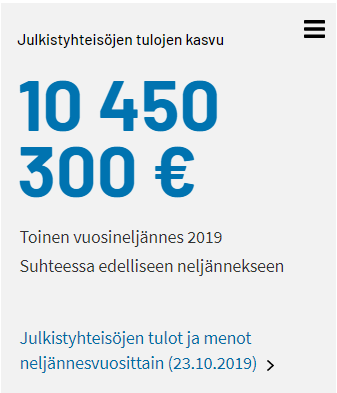
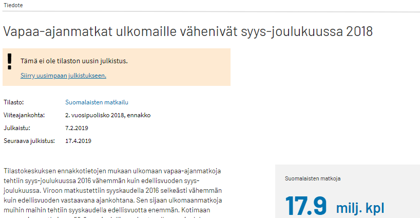
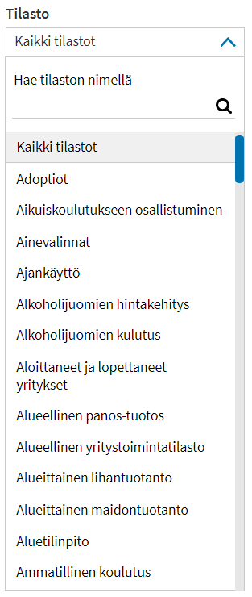
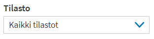
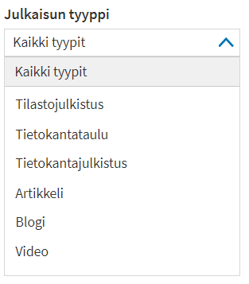
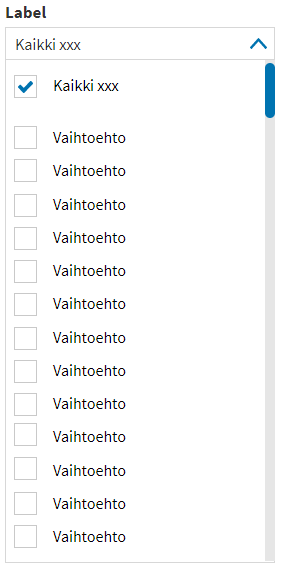
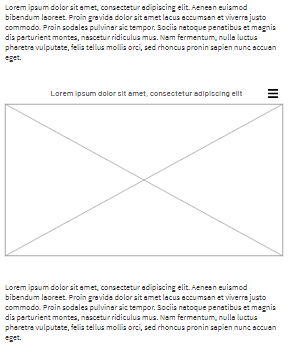
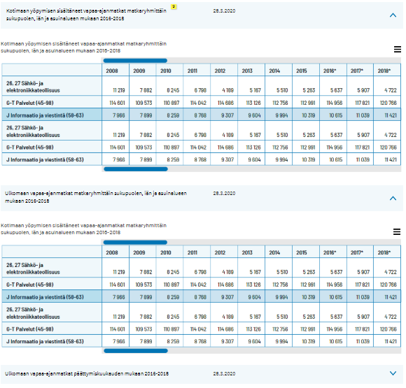

# Beta Design System <!-- omit in toc -->

## Sisällysluettelo <!-- omit in toc -->
- [Typografia](#typografia)
  - [Typografian saavutettavuus](#typografian-saavutettavuus)
- [Kuvat](#kuvat)
  - [Hero-kuva](#hero-kuva)
- [Ikonit](#ikonit)
- [Värit](#värit)
- [Sivupohja](#sivupohja)
  - [Navigaatio-palkki mobiili](#navigaatio-palkki-mobiili)
    - [Menu mobiili](#menu-mobiili)
  - [Navigaatio-palkki desktop](#navigaatio-palkki-desktop)
    - [Menut desktop](#menut-desktop)
  - [Sisältöalue](#sisältöalue)
  - [Sivuston tausta](#sivuston-tausta)
  - [Tekstipalsta](#tekstipalsta)
  - [Blokit](#blokit)
  - [Footer](#footer)
- [Komponentit](#komponentit)
  - [Avainluvut](#avainluvut)
    - [Avainlukujen tyylit](#avainlukujen-tyylit)
  - [Bannerit](#bannerit)
    - [Yleistä bannereista](#yleistä-bannereista)
    - [Bannerien koko](#bannerien-koko)
    - [Neutraali banneri](#neutraali-banneri)
    - [Huomio-banneri](#huomio-banneri)
    - [Varoitus-banneri](#varoitus-banneri)
    - [Bannerien saavutettavuus](#bannerien-saavutettavuus)
  - [Elementtien menut](#elementtien-menut)
  - [Info-laatikko](#info-laatikko)
    - [Info-laatikon tyylit](#info-laatikon-tyylit)
  - [Jakoviiva](#jakoviiva)
  - [Julkaisu-elementtien kuvat](#julkaisu-elementtien-kuvat)
    - [Place holder -kuvat](#place-holder--kuvat)
    - [Kuvien koko](#kuvien-koko)
  - [Laajennuspaneeli](#laajennuspaneeli)
    - [Yksittäinen laajennuspaneeli](#yksittäinen-laajennuspaneeli)
    - [Laajennuspaneeliryhmä](#laajennuspaneeliryhmä)
    - [Hierarkinen laajennuspaneelit](#hierarkinen-laajennuspaneelit)
    - [Laajennuspaneeleiden koko](#laajennuspaneeleiden-koko)
    - [Laajennuspaneelin tyylit](#laajennuspaneelin-tyylit)
    - [Laajennuspaneelin saavutettavuus](#laajennuspaneelin-saavutettavuus)
  - [Linkki](#linkki)
    - [Linkkien saavutettavuus](#linkkien-saavutettavuus)
    - [Sisäinen linkki](#sisäinen-linkki)
      - [Tavallinen linkki](#tavallinen-linkki)
      - [Negatiivi-linkki](#negatiivi-linkki)
      - [Linkki tekstin seassa](#linkki-tekstin-seassa)
      - [Linkki ikonilla](#linkki-ikonilla)
    - [Ulkoinen linkki](#ulkoinen-linkki)
  - [Lyhenteiden selitykset -laatikko](#lyhenteiden-selitykset--laatikko)
  - [Murupolku](#murupolku)
  - [Painikkeet](#painikkeet)
    - [Yleistä painikkeiden saavutettavuudesta](#yleistä-painikkeiden-saavutettavuudesta)
    - [Painikkeiden yhteiset ominaisuudet](#painikkeiden-yhteiset-ominaisuudet)
    - [Painikkeiden koko](#painikkeiden-koko)
    - [Ensisijainen painike](#ensisijainen-painike)
    - [Toisijainen painike](#toisijainen-painike)
    - [Kolmassijainen painike](#kolmassijainen-painike)
    - [Negatiivi-painike](#negatiivi-painike)
  - [Pilleri-painikkeet](#pilleri-painikkeet)
    - [Pilleri-painikkeiden saavutettavuus](#pilleri-painikkeiden-saavutettavuus)
    - [Pilleri-painikkeiden tyylit](#pilleri-painikkeiden-tyylit)
  - [Pudotusvalikko](#pudotusvalikko)
    - [Yleistä pudotusvalikoista](#yleistä-pudotusvalikoista)
      - [Pudotusvalikkojen yhteiset tyylit](#pudotusvalikkojen-yhteiset-tyylit)
    - [Tavallinen pudotusvalikko desktop-käyttöliittymissä](#tavallinen-pudotusvalikko-desktop-käyttöliittymissä)
      - [Tavallisen pudotusvalikon tyylit](#tavallisen-pudotusvalikon-tyylit)
    - [Multi select (monen valinnan) pudotusvalikko desktop-käyttöliittymissä](#multi-select-monen-valinnan-pudotusvalikko-desktop-käyttöliittymissä)
      - [Multi select -pudotusvalikon tyylit](#multi-select--pudotusvalikon-tyylit)
    - [Pudotusvalikoiden saavutettavuus](#pudotusvalikoiden-saavutettavuus)
  - [Pääkohdat](#pääkohdat)
  - [Tagit](#tagit)
    - [Aihe-tagit](#aihe-tagit)
    - [Muut tagit](#muut-tagit)
  - [Tilastokuviot](#tilastokuviot)
    - [Kuviot pienillä näytöillä](#kuviot-pienillä-näytöillä)
    - [Kuviot isoilla näytöillä](#kuviot-isoilla-näytöillä)
    - [Kuvion tooltip](#kuvion-tooltip)
    - [Kuvioiden lähdemerkintä](#kuvioiden-lähdemerkintä)
    - [Kuvioiden saavutettavuus](#kuvioiden-saavutettavuus)
    - [Kuvioiden tyylit](#kuvioiden-tyylit)
      - [Kuvioiden fontit](#kuvioiden-fontit)
      - [Kuvioiden hilaviivat](#kuvioiden-hilaviivat)
      - [Kuvioiden akselit](#kuvioiden-akselit)
    - [Kuviotyypit](#kuviotyypit)
      - [Viivakuvio](#viivakuvio)
      - [Piirakkakuvio](#piirakkakuvio)
      - [Pylväskuvio](#pylväskuvio)
  - [Tilastotaulukot](#tilastotaulukot)
    - [Taulukot pienillä näytöillä](#taulukot-pienillä-näytöillä)
    - [Taulukot isoilla näytöillä](#taulukot-isoilla-näytöillä)
      - [Taulukot tekstipalstan sisällä](#taulukot-tekstipalstan-sisällä)
      - [Taulukot muualla kuin tekstipalstan sisällä](#taulukot-muualla-kuin-tekstipalstan-sisällä)
    - [Taulukoiden alaviite](#taulukoiden-alaviite)
    - [Taulukoiden lähdemerkintä](#taulukoiden-lähdemerkintä)
    - [Taulukoiden saavutettavuus](#taulukoiden-saavutettavuus)
    - [Taulukoiden tyylit](#taulukoiden-tyylit)
      - [Taulukkopohjan tyylit](#taulukkopohjan-tyylit)
      - [Taulukon fontit](#taulukon-fontit)
  - [Tooltip](#tooltip)
    - [Tooltipin saavutettavuus](#tooltipin-saavutettavuus)
  - [Video](#video)
    - [Videoelementin koko](#videoelementin-koko)
    - [Videoiden saavutettavuus](#videoiden-saavutettavuus)
  - [Video-blokki](#video-blokki)
    - [Video-blokin tyylit](#video-blokin-tyylit)
  - [Vierityspalkki](#vierityspalkki)
    - [Pystysuuntainen vierityspalkki](#pystysuuntainen-vierityspalkki)
    - [Vaakasuuntainen vierityspalkki](#vaakasuuntainen-vierityspalkki)

## Typografia
Fontteina käytetään Googlen ilmaisia fontteja. Vaikka osa fonttien ko'oista on tässä ilmoitettu pikseleinä, ne tulee toteuttaa suhteellisina arvoina (em tai rem). 

| Taso                                                    | Font                            | Font-size                         | Font-family                                                    | Color   | Text-align                      | Vertical-align |
| ------------------------------------------------------- | ------------------------------- | --------------------------------- | -------------------------------------------------------------- | ------- | ------------------------------- | -------------- |
| **Leipäteksti**                                         | Source Sans Pro, regular        | 16px/1rem                         | Source Sans Pro, Arial, Verdana, Lucida, Helvetica, Sans-serif | #000000 |                                 |                |
| **H1**                                                  | Barlow, regular                 | 34px                              |                                                                | #000000 |                                 |                |
| **H2**                                                  | Barlow, regular                 | 28px                              |                                                                | #000000 |                                 |                |
| **H3**                                                  | Barlow, regular                 | 22px                              |                                                                | #000000 |                                 |                |
| **H4**                                                  | Barlow, medium                  | 16px                              |                                                                | #000000 |                                 |                |
| **H5**                                                  | Barlow, medium                  | 14px                              |                                                                | #000000 |                                 |                |
| **Introteksti** (aiheessa/tarkan aiheessa)              | Barlow, medium                  | 14px                              |                                                                | #000000 |                                 |                |
| **Tagit**                                               | Barlow, semibold                | 14px                              |                                                                | #333333 |                                 |                |
| **Aihe-tagit**                                          | Source Sans Pro, regular        | 14px                              |                                                                | #ffffff |                                 |                |
| **Päiväys ja kirjoittaja** (blokkien nostoelementeissä) | Barlow, regular                 | 14px                              |                                                                | #000000 |                                 |                |
| **Ingressi**                                            | Barlow, regular                 | 17px/1.255rem                     |                                                                | #000000 |
| **Iso leipäteksti (esim. asiantuntijan nimi)**          | Source Sans Pro, regular        | 18px                              |                                                                | #000000 |                                 |                |
| **Label**                                               | Source Sans Pro, semibold       | 17px                              |                                                                | #000000 |                                 |                |
| **Murupolku, linkki**                                   | Barlow, medium                  | 14px                              |                                                                | #006ca5 |                                 |                |
| **Murupolku, ei linkki**                                | Barlow, medium                  | 14px                              |                                                                | #000000 |                                 |                |
| **Taulukon otsikko**                                    | Barlow Semi Condensed, regular  | 1rem (16px)                       |                                                                | #000000 |                                 |                |
| **Taulukon sarake- ja riviotsikot**                     | Barlow Semi Condensed, semibold | 1rem (16px)                       |                                                                | #000000 | ks. taulukon solujen text-align | bottom         |
| **Taulukon solut: numero tai numeron korvaava teksti**  | Barlow Semi Condensed, regular  | 0.9rem (15px) tai 0.875rem (14px) |                                                                | #000000 | right                           | bottom         |
| **Taulukon solut: teksti**                              | Barlow Semi Condensed, regular  | 0.9rem (15px) tai 0.875rem (14px) |                                                                | #000000 | left                            | bottom         |
| **Taulukon alaviite**                                   | Barlow Semi Condensed, regular  | 1rem (16px)                       |                                                                | #000000 |                                 |                |
| **Taulukon ja kuvion lähdemerkintä**                    | Barlow Semi Condensed, regular  | 1rem (16px)                       |                                                                | #000000 |                                 |                |
| **Tilastokuvion otsikko**                               | Barlow Semi Condensed, medium   | 1rem (16px)                       |                                                                | #000000 | center                          |                |
| **Tilastokuvion alaotsikko**                            | Barlow Semi Condensed, regular  | 1rem (16px)                       |                                                                | #000000 | center                          |                |
| **Tilastokuvion muut tekstit**                          | Barlow Semi Condensed, regular  | 1rem (16px)                       |                                                                | #000000 |                                 |                |
| **Tilastokuvion tooltip**                               | Barlow Semi Condensed, regular  | 1rem (16px)                       |                                                                | #000000 |                                 |                |

### Typografian saavutettavuus
* Fonttien koot tulee toteuttaa suhteellisina arvoina (em tai rem), jolloin käyttäjät pystyvät suurentamaan niitä halutessaan. 
* Fontteja ei saa muotoilla itse vaan on käytettävä yllä esitettyjä fonttitasoja. Näin ruudunlukijaa käyttävät saavat sivujen rakenteesta oikean käsityksen ja myös fonttityylien yhtenäisyys säilyy. 

## Kuvat
### Hero-kuva

Hero-kuvia käytetään aihe- ja tarkka aihe -sivujen yläosassa. Jokaisella aiheella ja tarkalla aiheella on oma kuvansa. Hero-kuviksi valitaan sellaisia, jotka toimivat monessa koossa. 

Mobiilissa hero-kuva ulottuu näytön laidasta laitaan. Mobiilinäytöllä näkyy täysikokoisesta kuvasta rajattu tietty kohta. (Kohta määritellään myöhemmin tarkemmin.) Mobiilissa sivun otsikko ja sen sininen tausta tulevat hero-kuvan alle. 

Desktopissa hero-kuva ulottuu näytön laidasta laitaan kunnes kuvan koko tulee vastaan. Sen jälkeen kuvan vasemmalle ja oikealle puolelle tulee marginaalit. Kuva-alueen korkeus pysyy samana koko ajan ja kuva rajautuu korkeudesta näytön koon kasvaessa. Desktopissa sivun otsikko ja otsikon alla oleva sininen palkki tulee kuvan päälle. 

## Ikonit

Ikoneina käytetään (jo aiemmin käytössä olleita) Font Awesomen ja IcoMoonin ilmaisia perus ikonikirjastoja. Linkki ikonikirjastoihin lisätään myöhemmin. 

## Värit
Väreinä käytetään Tilastokeskuksen väripalettia. Värit täydennetään tänne tai linkki niihin lisätään myöhemmin. 

## Sivupohja

### Navigaatio-palkki mobiili

Kuvaus lisätään ui-designin valmistuttua. 

#### Menu mobiili
	
### Navigaatio-palkki desktop

| Max-width | Background-color | Sisältöalueen leveys | Sisällön tasaus |
| --------- | ---------------- | -------------------- | --------------- |
| 2500px    | #0073b0          | 1200px               | left            |

Navigaatio-palkin taustan leveys on näytön/selainikkunan laidasta laitaan 2500px asti. Siitä ylöspäin navipalkin oikealle ja vasemmalle puolelle tulee marginaalit. 
*Poikkeus:* 
Jos ollaan sivulla, jossa on bannerikuva (aiheen ja tarkennetun aiheen sivuilla): navipalkin tausta on näytön laidasta laitaan kunnes bannerikuvan rajat tulevat vastaan: navipalkki loppuu siinä missä bannerikuvakin. 

Navipalkin sisältöalue on leveydeltään 1200px eli sama kuin muukin sisältöalue. Navipalkin sisältö pysyy sisältöalueen sisällä, se ei leviä taustan mukana näytön koon kasvaessa. Navipalkin sisältö on samassa linjassa sivun muun sisällön kanssa eli alkaa vasemmassa laidassa samasta kohdasta kuin sivuston muukin sisältö. Navipalkin sisältö on tasattu vasempaan laitaan eikä siis levity tasaisesti koko navipalkin alueelle. 

| Font          | Font-size | Color   | Font-variant | Text-decoration | Padding                                                                      |
| ------------- | --------- | ------- | ------------ | --------------- | ---------------------------------------------------------------------------- |
| Barlow medium | 1.1rem    | #ffffff | normal       | none            | padding-left ja padding-right: 1.5rem, padding-top ja padding-bottom: 1.2rem |
			
Navigaatiopalkin linkkien välissä on ohuet pystyviivat. Viivojen korkeus sama kuin navipalkin korkeus: 
| Width | Color   |
| ----- | ------- |
| 1px   | #338fc0 |

Se sivuston osio, jossa kulloinkin ollaan, näkyy navigaatiopalkissa korostettuna. Korostuksen tyyli määritellään myöhemmin tarkemmin. 

#### Menut desktop
Navigaatiopalkista avautuvien menujen sisältö on tasattu vasempaan laitaan. Kuvat ja kuvaus lisätään ui-designin valmistuttua. 

### Sisältöalue

|             | Leveys | Palstoja max |
| ----------- | ------ | ------------ |
| **Desktop** | 1200px | 3            |
| **Mobiili** |        | 1            |

Sisältöalueen maksimileveys desktopissa on 1200px. Sisältöalue on jaettu desktopissa maksimissaan kolmeen palstaan ja mobiilissa yhteen palstaan. Desktopin kolme palstaa asettuvat responsiivisesti allekkain näytön/selainikkunan pienentyessä. 

### Sivuston tausta

Saavutettavuuden parantamiseksi sivuston tausta ei ole puhtaan valkoinen vaan 2% musta. 

| Background          |
| ------------------- |
| valkoinen, 2% musta |

	
### Tekstipalsta

|             | Width | Text-align |
| ----------- | ----- | ---------- |
| **Desktop** | 555px | left       |
| **Mobiili** |       | left       |

### Blokit

|             | Background-color    | Margin        | Padding                                                                                                                                |
| ----------- | ------------------- | ------------- | -------------------------------------------------------------------------------------------------------------------------------------- |
| **Desktop** | valkoinen, 2% musta | 2.5rem (40px) | 2.5rem (40px)                                                                                                                          |
| **Mobiili** | valkoinen, 2% musta | 2.5rem (40px) | **Padding-top** ja **padding-bottom**: puolet desktopin paddingista. **Padding-left** ja **padding-right**: 1/4 desktopin paddingista. |

### Footer 

| Max-width | Sisältöalueen leveys | Background-color | Palstoja max |
| --------- | -------------------- | ---------------- | ------------ |
| 2500px    | 1200px               | #0073b0          | 4            |
		
Footerin tausta ulottuu aina laidasta laitaan, sekä isoissa että pienissä näytöissä/selainikkunoissa. 
Isoissa desktop-näytöissä 2500px leveyteen asti koko näytön levyinen, siitä ylöspäin tulee marginaalit. Eli footerin tausta käyttäytyy deskarissa kuten yläpalkin ja navipalkin tausta. 
	
Footerin sisältöalue on leveydeltään 1200px eli sama kuin muukin sisältöalue.

Footerissa on neljä palstaa: ensimmäisessä Tilastokeskuksen logo, kolmessa muussa on linkkejä. Palstat käyttäytyvät responsiivisesti eli näytön/selainikkunan pienentyessä palstat hyppäävät allekkain: ensin kahteen riviin siten että kaksi ensimmäistä palstaa on samalla rivillä ja loput toisella, sitten neljään riviin eli jokainen palsta omalle rivilleen. 

## Komponentit

### Avainluvut

Avainluvussa kerrotaan yksi tilastoluku, mitä ajankohtaa se koskee sekä tarjotaan reitti eteenpäin tietokantaan ja sivulle, josta löytyy lisätietoa aiheesta. Avainluvun tarkoituksena on kiinnittää käyttäjien huomio ja houkutella heidät tutkimaan lukuun liittyvää tietoa enemmän. Avainluvun voi jakaa myös sosiaalisessa mediassa. 

Avainluvut sisältävät seuraavat elementit:
* otsikko, 
* menu. Menun sisällöstä kerrotaan kohdassa Elementtien menut. 
* avainluku, 
* avainluvun yksikkö, 
* viiteajankohta, 
* muu tarkentava teksti, optionaalinen, 
* linkki avainluvun ensisijaikseksi merkitylle sivulle, ns. "kotisivulle".

Avainlukuja on tarkan aiheen, tilaston, tiedotteen ja katsauksen sivuilla. Sama avainluku voi esiintyä useilla eri sivuilla. Avainluku merkitään kuitenkin aina kuuluvaksi ensisijaisesti johonkin tilastoon, tiedotteeseen, katsaukseen tai tarkkaan aiheeseen. Avainluvussa oleva linkki vie tälle avainluvun ensisijaiseksi merkitylle sivulle, ns. avainluvun "kotisivulle". Avainluvussa ei ole linkkiä silloin kun se esiintyy ensisijaikseksi merkityllä sivullaan. 

Avainluvut asettuvat omassa Avainluvut-blokissaan responsiivisesti rinnakkain tai allekkain näytön koosta riippuen. Pienillä näytöillä avainluvut asettuvat allekkain. Isoilla näytöillä avainlukuja on Avainluvut-blokissaan enintään kolme rinnakkain: 

Avainluku-elementit venyvät tarvittaessa pituutta. Kaikki samalla rivillä olevat avainluvut ovat kuitenkin saman pituisia eli vähemmän sisältöä sisältävät avainluvut venyvät pituutta pisimmän avainluvun mukaan. 

Tiedotteessa avainluvut sijaitsevat ingressin alla ja ennen Pääkohdat-elementtiä kun sivua katsotaan pieneltä näytöltä. Isoilla näytöillä avainluku tai avainluvut asettuvat ingressin oikealle puolelle omaan palstaansa allekkain. **Huom!** Isoilla näytöllä on sama selaus-/lukujärjestys näppäimistökäytössä kuin pienillä näytöillä eli avainlukujen jälkeen siirrytään Pääkohdat-elementtiin. 

Avainluvut voivat sijaita katsauksessa tekstin seassa, jolloin ne ottavat tekstipalstan leveyden. 

#### Avainlukujen tyylit
|                                           | Font                        | Font-size | Color   | Background-color |
| ----------------------------------------- | --------------------------- | --------- | ------- | ---------------- |
| Avainluvun laatikko                       |                             |           |         | #f2f2f2          |
| Avainluvun otsikko                        | Barlow, medium              | 14px      | #000000 |                  |
| Avainluku                                 | Barlow Semi Condenced, bold | 65px      | #0073b0 |                  |
| Avainluvun lyhyt yksikkö (max. 2 merkkiä) | Barlow Semi Condenced, bold | 65px      | #0073b0 |                  |
| Avainluvun pitkä yksikkö                  | Barlow Semi Condenced, bold | 35px      | #0073b0 |                  |
| Avainluvun viiteajankohta                 | leipäteksti                 |           |         |                  |
| Avainluvun muu teksti                     | leipäteksti                 |           |         |                  |
| Avainluvun linkki                         | tavallinen linkki nuolella  |           |         |                  |

### Bannerit

#### Yleistä bannereista
Bannerit ovat huomiota herättäviä väliaikaisia elementtejä, joilla viestitään sivustoon ja sen sisältöön liittyvistä muutoksista ja poikkeustilanteista. Bannereiden tarkoitus on vetää käyttäjien huomio puoleensa erottumalla sivuston muusta sisällöstä. Bannereita on eri tyylisiä. Riippuu banneriin tulevasta sisällöstä minkä tyylinen banneri valitaan. 

Banneri ei ole sivuston kiinteä elementti vaan niille määritellään tietty aika, jonka ajan ne ovat verkkosivuilla näkyvissä. Lähtökohtaisesti verkkosivuston loppukäyttäjät eivät saa itse poistettua bannereita näkyvistä, mutta muutamia poikkeuksia voi olla, kuten sivustouudistuksesta kertova banneri. Bannereita tulee käyttää harkitusti ja niillä viestitään vain poikkeuksellisista muutoksista ja tilanteista. 

Bannerit sisältävät aina tekstiä ja sen lisäksi niissä voi olla linkki ja ikoni. Tekstin tulee kertoa ilmoitusasia lyhyesti ja ytimekkäästi. On suositeltavaa tarjota myös linkki sivulle, jossa asiasta kerrotaan lisää. Banneritekstin otsikkona käytetään ns. isoa leipätekstiä ja muun tekstin fonttina tavallista leipätekstiä. Bannereihin ei ole pakollista laittaa otsikkoa. 

#### Bannerien koko
Pienillä näytöillä bannerit ulottuvat näytön laidasta laitaan. Isoilla näytöillä yksittäistä sivua tai sen osaa koskevat bannerit ovat yhtä leveitä kuin se elementti, jonka sisällä ne ovat tai johon ne liittyvät. 

Koko sivustoa koskevat bannerit näkyvät navigaatiopalkin alla ja ovat isoilla näytöillä yhtä leveitä kuin navigaatiopalkki. Esimerkiksi sivustouudistuksesta kertova banneri:

#### Neutraali banneri
Neutraalia banneria käytetään ilmoittamaan asiasta, joka käyttäjän on hyvä, mutta ei kriittistä huomata. Neutraali banneri erottuu sivuston muusta sisällöstä hienovaraisesti. 

Neutraali banneri, mobiili-versio:

Neutraali banneri, desktop-versio:

Neutraalia banneria voidaan käyttää ilmoittamaan esimerkiksi tilastossa tapahtuneista muutoksista: 

Neutraalin bannerin tyylit:
|                          | Font                     | Font-size      | Color   | Text-decoration | Background-color | Border  | Padding                          |
| ------------------------ | ------------------------ | -------------- | ------- | --------------- | ---------------- | ------- | -------------------------------- |
| **Banneri-laatikko**     |                          |                |         |                 | #ffffff          | #a40084 | top/bottom: 2rem left/righ: 1rem |
| **Otsikko = iso leipäteksti** | Source Sans Pro, regular | 18px           | #000000 |                 |                  |     
| **Teksti = leipäteksti** | Source Sans Pro, regular | 1rem (n. 16px) | #000000 |                 |                  |         |                                  |
| **Linkki**               | Source Sans Pro, regular | 1rem (n. 16px) | #006ca5 | underline       |                  |         |                                  |

#### Huomio-banneri

Huomio-banneria käytetään ilmoittamaan asiasta, joka käyttäjän on tärkeää huomata. Se erottuu selkeästi sivuston muusta sisällöstä. Huomio-bannerissa on huomiota herättävä taustaväri sekä vasemmassa laidassa iso huutomerkki-ikoni vetämässä käyttäjien huomiota puoleensa ja korostamassa ilmoituksen tärkeyttä.

Huomio-banneri, mobiili-versio:

Huomio-banneri, desktop-versio:

 Huomio-banneria voidaan käyttää esimerkiksi ilmoittamaan tieto, että käyttäjä ei ole uusimman tiedotteen sivulla vaan vanhalla:

Huomio-bannerin tyylit:
|                              | Font                     | Font-size      | Color   | Text-decoration | Background-color | Border | Padding                          |
| ---------------------------- | ------------------------ | -------------- | ------- | --------------- | ---------------- | ------ | -------------------------------- |
| **Banneri-laatikko**         |                          |                |         |                 | feead2          |        | top/bottom: 2rem left/righ: 1rem |
| **Otsikko = iso leipäteksti** | Source Sans Pro, regular | 18px           | #000000 |                 |                  |        |                                  |
| **Teksti = leipäteksti** | Source Sans Pro, regular | 1rem (n. 16px) | #000000 |                 |                  |  
| **Linkki**                   | Source Sans Pro, regular | 1rem (n. 16px) | #006ca5 | underline       |                  |        |                                  |
| **Ikoni**                    |                          |                | #000000 |                 |                  |        |                                  |

#### Varoitus-banneri

Varoitus-banneria käytetään kriittisten ilmoitusten ja ongelmia yhteydessä, kuten silloin kun verkkopalvelussa on sen toimintaa haittaava tai estävä häiriö. Varoitus-bannerissa on voimakas taustaväri sekä vasemmassa laidassa iso huutomerkki-ikoni vetämässä käyttäjien huomiota puoleensa ja korostamassa ilmoituksen tärkeyttä.

Varoitus-banneri, mobiili-versio:

Varoitus-banneri, desktop-versio:

Varoitus-bannerin tyylit
|                              | Font                     | Font-size      | Color   | Text-decoration | Background-color | Border | Padding                          |
| ---------------------------- | ------------------------ | -------------- | ------- | --------------- | ---------------- | ------ | -------------------------------- |
| **Banneri-laatikko**         |                          |                |         |                 | #c30045          |        | top/bottom: 2rem left/righ: 1rem |
| **Otsikko = iso leipäteksti** | Source Sans Pro, regular | 18px           | #ffffff |                 |                  |        |                                  |
| **Teksti = leipäteksti** | Source Sans Pro, regular | 1rem (n. 16px) | #ffffff |                 |                  |  
| **Linkki**                   | Source Sans Pro, regular | 1rem (n. 16px) | #ffffff | underline       |                  |        |
| **Ikoni**                    |                          |                | #ffffff |                 |                  |        |                                  |

#### Bannerien saavutettavuus
* Huomio- ja varoitus-bannerien huutomerkki-ikoni piilotetaan ruudunlukijalta. 
* Jos banneri sisältää linkin, vain tämä linkki on linkki. Koko banneri ei siis toimi linkkinä eikä semanttisesti ole linkki. 

### Elementtien menut

Avainlukujen, tilastotaulukoiden ja tilastokuvioiden oikeasta yläkulmasta löytyy menu-ikoni. Menu sisältää linkin tietokantaan siihen tietokantataulukkoon, josta elementin data on peräisin, datan lataamisen eri formaateissa, linkin elementin jakamiseen sosiaalisessa mediassa sekä suosikkeihin lisäämisen toiminnon (tulossa verkkosivustolle myöhemmin). 

Kun menun avaa, menu-ikoni muuttuu ruksiksi. Ruksista menun saa kiinni. Menun sulkeuduttua ikoni palaa jälleen menu-ikoniksi. Näppäimistökäytössä menun avaaminen, sulkeminen, selaaminen ja valintojen tekeminen toimii samalla tavalla kuin tavalliset pudotusvalikot, ks. kohta Pudotusvalikoiden saavutettavuus. Menu aukeaa menu-ikonin alle elementtinsä päälle sekä pienillä että isoilla näytöillä. 

Menussa ensimmäisenä oleva Taulukko tietokannassa -linkki vie tietokantaan siihen tietokantataulukkoon, josta elementin data on peräisin. Koska tietokantataulukko sijaitsee eri verkkopalvelussa, linkki on ulkoinen linkki, ks. kohta Ulkoinen linkki. 

Dataan pohjautuvien elementtien menuissa on tarjolla ainakin datan lataaminen taulukkomuodossa: mm. xlsx- ja csv-formaateissa. Jos elementti on tilastokuvio, tarjolla on myös datan lataaminen kuvamuodossa: mm. svg- ja png-formaateissa. Formaatti ilmoitetaan suluissa Lataa taulukko - tai Lataa kuvio -tekstien perässä. 

|                                             | Font            | Color   | Background-color | Border  | Height                       | Width                        |
| ------------------------------------------- | --------------- | ------- | ---------------- | ------- | ---------------------------- | ---------------------------- |
| Menu-ikoni                                  |                 | #000000 |                  |         | (riippuu valitusta ikonista) | (riippuu valitusta ikonista) |
| Ruksi-ikoni                                 |                 | #000000 |                  |         | (riippuu valitusta ikonista) | (riippuu valitusta ikonista) |
| Menun laatikko                              |                 |         | #ffffff          | #c9c9c9 |                              |                              |
| Menun horisontaalinen divider               |                 |         |                  | #c9c9c9 |                              |                              |
| Linkki tietokantataulukkoon                 | Ulkoinen linkki |         |                  |         |                              |                              |
| Muiden toimintojen teksti                   | Leipäteksti     |         |                  |         |                              |                              |
| Menun listan kohdan hover                   |                 |         | #f2f2f2          |         |                              |                              |
| Menun listan kohta selected/pressed-tilassa |                 |         | #f2f2f2          |         |                              |                              |

### Info-laatikko

Info-laatikko on väritaustainen muusta sisällöstä erottuva elementti. Sen sisältö liittyy sivun muuhun sisältöön, mutta sen halutaan erottautuvan muusta sisällöstä.  

Mobiilissa Info-laatikko on aina täysilevyinen. Desktop-koossa info-laatikko voi olla tavallisen blokin sisältöalueen levyinen tai puolet siitä. Info-laatikkoa voidaan käyttää myös oikeassa palstassa. 

Taustaväriltään info-laatikko on joko vaaleansininen tai valkoinen. Tarkemmat tyylit löytyvät kohdasta Info-laatikon tyylit. 

#### Info-laatikon tyylit

|            | Color   | Background-color    | Width                                |
| ---------- | ------- | ------------------- | ------------------------------------ |
| Tausta     |         | #f2f8fb tai #ffffff | mobiili: 100%, desktop: 100% tai 50% |
| Reunaviiva | #0073b0 |                     | 3px                                  |

### Jakoviiva

Jakoviiva on kapea harmaa vaakaviiva, joka erottaa sisältöjä toisistaan. Jakoviivoja voidaan käyttää myös asioiden ryhmittelyyn asettamalla niitä eri ryhmien väliin, esim. menuissa. 

| Height | Color   |
| ------ | ------- |
| 1px    | #aaaaaa |

Ensisijaisesti eri osioiden erottamiseen toisistaan tulee käyttää tyhjää tilaa. Niissä tilasteissa, joissa tyhjää tilaa ei voida käyttää tai se ei ole riittävä tapa, käytetään jakoviivoja.  

Jakoviivoilla voidaan myös erottaa saman kokonaisuuden tai toisiinsa liittyviä elementtejä toisistaan. 

### Julkaisu-elementtien kuvat
Julkaisu-elementeissä artikkelien, blogien ja videoiden kuvina käytetään graafikoiden tekemiä ja valitsemia valokuvia. Kokoomajulkaisujen kuvina käytetään julkaisun omasta kansikuvasta muokattua (graafikoiden tekemää) webiin sopivaa kuvaa. Tiedotteiden, tietokantajulkaisujen ja katsauksien julkaisu-elementeissä kuvina käytetään ns. place holder -kuvia.

| Julkaisutyyppi                      | Kuvan tyyppi       |
| ----------------------------------- | ------------------ |
| Artikkeli                           | Valokuva           |
| Blogi                               | Valokuva           |
| Muu julkaisu, esim. kokoomajulkaisu | Valokuva           |
| Katsaus                             | Place holder -kuva |
| Tiedote                             | Place holder -kuva |
| Tietokantajulkistus                 | Place holder -kuva |
| Video                               | Valokuva           |

#### Place holder -kuvat

#### Kuvien koko
Julkaisut-elementeissä olevat kuvat käyttävät samaa kuvasuhdetta kuin video-elementti. Katso video-elementin kuvasuhde kohdasta Video. 

**Huom!** Julkaisuissa tekstin seassa olevat kuvat ja tilastokuviot eivät välttämättä noudata samaa kuvasuhdetta kuin julkaisu-elementtien kuvat. Etenkin tilastokuvioiden kokoon vaikuttaa niissä oleva data eikä niitä kaikkia voida rajata kooltaan saman kokoisiksi etekään pituudesta. 

### Laajennuspaneeli 
(Eng. expansion panel)

Laajennuspaneeli on elementti, jonka otsikon alle on piilotettu sisältöä. Laajennuspaneelia klikkaamalla sisällön saa esiin ja taas piiloon. Laajennuspaneelilla on aina jokin nimi tai otsikko, joka näkyy paneelin sinisellä taustalla. Laajennuspaneeleilla voidaan lyhentää sivun pituutta. Kun niitä käytetään ryhmänä, ne auttavat hahmottamaan laajoja kokonaisuuksia.

#### Yksittäinen laajennuspaneeli

Laajennuspaneelit ovat oletusarvoisesti suljettuja. Laajennuspaneelia klikkaamalla sisällön saa esiin ja taas piiloon. Suljetun laajennuspaneelin oikean laidan nuoli osoittaa alas.

Avatun laajennuspaneelin oikean laidan nuoli kääntyy osoittamaan ylös. Ruudunlukijakäyttäjälle tulee kertoa onko laajennuspaneeli auki vai kiinni. 

#### Laajennuspaneeliryhmä

Laajennuspaneeleita voidaan käyttää yksittäin tai ryhmässä. Ryhmässä olevien laajennuspaneeleiden sisältöjen tulee muodostaa yhtenäinen kokonaisuus. Useita laajennuspaneeliryhmän osia voi olla avattuna auki samaan aikaan.

Samaan ryhmään kuuluvat laajennuspaneelit asettuvat yleensä allekkain. Ne voivat asettua isoilla näytöillä myös vierekkäin, jos ne eivät tarvitse koko sisältöalueen leveyttä eikä niillä ei ole tarkkaa keskenäistä järjestystä tai hierarkiaa. Tällainen tapaus on esim. Usein kysytyt kysymykset -blokin laajennuspaneelit:  

#### Hierarkinen laajennuspaneelit

Laajennuspaneelit voivat olla hierarkisia. Hierarkia on enintään kaksi tasoa syvä. Sisempi taso on sisennetty ensimmäisen tason alle. Tällä sisennyksellä viestitään visuaalisesti laajennuspaneelien hierarkista rakennetta. Ruudunlukijakäyttäjille on myös välitettävä tieto hierarkiasta. 

#### Laajennuspaneeleiden koko

Laajennuspaneeleiden korkeus on vähintään 60px, mutta ne venyvät tarvittaessa korkeammaksi otsikoidensa tekstien mukaan. Leveydeltään laajennuspaneelit voivat olla blokkinsa koko sisältöalueen levyisiä tai vain puolet siitä. 

#### Laajennuspaneelin tyylit

|                  | Font                                   | Font-size | Color   | Background-color | Min-height |
| ---------------- | -------------------------------------- | --------- | ------- | ---------------- | ---------- |
| Paneeli          | (leipäteksti) Source Sans Pro, regular | 16px/1rem | #000000 | #F2F8FB          | 60px       |
| Nuoli            |                                        |           | #0073B0 |                  |            |
| Paneelin sisältö | (leipäteksti) Source Sans Pro, regular | 16px/1rem | #000000 | #ffffff          |            |

#### Laajennuspaneelin saavutettavuus
* Kaikki käyttäjät eivät välttämättä huomaa laajennuspaneeli-elementtiä tai ymmärrä miten se toimii. Siksi laajennuspaneeliin ei pidä laittaa sellaista sisältöä, joka on käyttäjälle tärkeää huomata tai löytää. 
* Laajennuspaneeliryhmän sisällön tulee muodostaa yhtenäinen kokonaisuus. 
* Ruudunlukijalle tulee kertoa onko laajennuspaneeli auki vai kiinni. 
	
### Linkki

Linkkejä käytetään navigaatiossa sivuston sisällä sekä navigoinnissa ulkoisiin sivustoihin ja palveluihin. 

#### Linkkien saavutettavuus
* Yleisiä Katso lisää -tyylisiä linkkejä on hyvä välttää. Linkin tekstin tulee olla mahdollisimman tarkoitustaan tai kohdesivuaan kuvaava. 
* Linkkien tekstien tulee olla mahdollisimman paljon kohdesivun otsikkoa vastaavia. 
* Jos linkissä on ikoni, ikoni piilotetaan ruudunlukijalta ja sille ei tehdä alt-tekstiä. Poikkeuksena ulkoiselle sivustolle vievien linkkien ikoni. 
* Jos linkki vie ulkoiselle sivustolle, on tämä käytävä linkistä ilmi sekä ruudunlukijaa käyttäville että näkeville käyttäjille. Jo linkin tekstissä olisi hyvä ilmaista, että linkki vie toiseen palveluun. Näkeviä käyttäjiä varten linkin yhteyteen lisätään myös ulkoisen linkin ikoni. Ruudunlukijaa varten ikoniin lisätään alt-teksti, joka kertoo, että linkki vie ulkoiselle sivustolle. 
* Jos linkki avaa tiedoston, on tämä käytävä ilmi sekä näkeville että ruudunlukijaa käyttäville käyttäjille. Linkin loppuun laitetaan esimerkiksi sulkuihin tiedoston muoto: (pdf).
* Linkkien tyylit on pidettävä yhtenäisinä. Navigaatiolinkit ovat poikkeus tästä, niillä on omat tyylinsä. 
* Kaikki linkit toimivat näppäimistökäytössä vain enterillä. 

#### Sisäinen linkki

##### Tavallinen linkki

 Tavallisissa tekstistä erillään olevissa linkeissä on alleviivaus vain hover- ja focus-tilassa. 

| Tila           | Font        | Text-decoration | Color   | Muuta                                 |
| -------------- | ----------- | --------------- | ------- | ------------------------------------- |
| **Tavallinen** | Leipäteksti | none            | #006ca5 |                                       |
| **Hover**      |             | underline       | #0039a6 | Kursori muuttuu kädeksi linkin päällä |
| **Focus**      |             | underline       | #0039a6 | Reunus: 2px, #0073b0                  |
| **Vierailtu**  |             | none            | #551a8b |                                       |

Tavallinen-tila:

Hover-tila:

Focus-tila:

Vierailtu-tila:

##### Negatiivi-linkki

Negatiivi-linkki on linkki tummalla taustalla. Tumman taustan vuoksi sen tyylit eri tiloissa hieman eroavat tavallisesta linkistä. 

| Tila           | Font        | Text-decoration | Color   | Muuta                                 |
| -------------- | ----------- | --------------- | ------- | ------------------------------------- |
| **Tavallinen** | Leipäteksti | none            | #ffffff |                                       |
| **Hover**      |             | underline       | #ffffff | Kursori muuttuu kädeksi linkin päällä |
| **Focus**      |             | underline       | #ffffff | Reunus: 2px, #ffffff                  |
| **Vierailtu**  |             | none            | #ffffff |                                       |

Tavallinen-tila:

Hover-tila:

Focus-tila:

Vierailtu-tila:

##### Linkki tekstin seassa

Tekstin seassa, eli p-elementin sisällä, olevat linkit alleviivataan aina. Muissa linkeissä on alleviivaus vain hover- ja focus-tilassa. 

| Tila           | Font        | Text-decoration | Color   | Muuta                                 |
| -------------- | ----------- | --------------- | ------- | ------------------------------------- |
| **Tavallinen** | Leipäteksti | underline       | #006ca5 |                                       |
| **Hover**      |             | underline       | #0039a6 | Kursori muuttuu kädeksi linkin päällä |
| **Focus**      |             | underline       | #0039a6 | Reunus: 2px, #0073b0                  |
| **Vierailtu**  |             | underline       | #551a8b |                                       |

##### Linkki ikonilla

Ikoneja voidaan käyttää linkkien osana helpottamaan linkin tunnistamista tai huomaamista. 

Ikoni tulee linkin eteen (poikkeuksena ulkoinen linkki, jossa ikoni tulee tekstin jälkeen) ja on samanvärinen kuin linkin teksti. Ikoni on osa linkkiä. 

Yksittäisessä erillään olevassa linkissä linkin perässä oleva nuoli korostaa, että linkistä tapahtuu jotain. Nuoli on aina linkin perässä. Nuoli-ikoni ei ole osa linkkiä, siitä klikkaamalla ei tapahdu mitään. 

Linkeillä voi olla myös kaksi ikonia. Ikonit asettuvat silloin linkkitekstin molemmille puolille. 

Linkkien ikonien tyylit:

| Ikoni                         | Color   |
| ----------------------------- | ------- |
| **Nuoli**                     | #000000 |
| **StatFin/database**          | #f59a23 |
| **Muut ikonit**               | #0073b0 |
| **Negatiivi-linkkien ikonit** | #ffffff |

#### Ulkoinen linkki

Ulkoisen linkin tekstissä pyritään kertomaan, että linkki vie toiseen sivustoon tai palveluun. Linkkitekstin perässä on ulkoisen linkin ikoni, joka on osa linkkiä. Ruudunlukijaa varten ikoniin lisätään alt-teksti, joka kertoo, että linkki vie ulkoiselle sivustolle. Ikonin alt-tekstissä lukee: Siirryt toiseen verkkopalveluun. 

### Lyhenteiden selitykset -laatikko

Lyhenteiden selitykset -laatikko sisältää lyhenteiden ja merkkien selityksiä siellä missä niitä on tarpeen selittää käytäjille. Laatikko esiintyy esimerkiksi tietokantataulukoiden yhteydessä, jolloin se sisältää selitykset siitä mitä tietokantataulukoiden viiteajankohdissa olevat lyhenteet tarkoittavat. Laatikko sijaitsee sivulla tai blokissa ennen niitä elementtejä, joiden sisältöön se liittyy. 

Mobiilissa ja pienillä näytöillä laatikon sisältö menee allekkain:

Isoilla näytöillä laatikko ja laatikon sisältö sisältö levittäytyy sivusuunnassa. Tietokantataulukoiden yhteydessä se on yhtä leveä kuin tietokantataulukoiden väliset dividerit eli se asettuu niiden kanssa samaan linjaan:

|              | Font                          | Font-size   | Border       | Width                                                                 | Padding                           |
| ------------ | ----------------------------- | ----------- | ------------ | --------------------------------------------------------------------- | --------------------------------- |
| **Label**    | Pudotusvalikon label:n fontti |             |              |                                                                       |                                   |
| **Lyhenne**  | Source Sans Pro semibold      | 1rem (16px) |              |                                                                       |                                   |
| **Teksti**   | Leipätekstin fontti           |             |              |                                                                       |                                   |
| **Laatikko** |                               |             | #aaaaaa, 1px | Desktopissa: saman levyinen kuin tietokantataulukko-elementin divider | top/bottom: 2rem left/right: 1rem |

### Murupolku

 Viimeistä osaa lukuunottamatta murupolun osat ovat linkkejä. Murupolkun linkkiosat käyttäytyvät kuten tavalliset linkit kaikkine eri tiloineen. Murupolun fonttina on H5-otsikkotason fontti. Vaikka murupolku noudattaa H5-tason fonttia, se ei ole semanttisesti H5-tason otsikko vaan navigaatio-elementti. 

 Osiot erotetaan toisistaan /-merkillä. 

| Murupolun osa | Font           | Font-size | Color   | Muuta                                  |
| ------------- | -------------- | --------- | ------- | -------------------------------------- |
| **Linkki**    | Barlow, medium | 14px      | #006ca5 | samat tilat kuin tavallisella linkillä |
| **Viimeinen** | Barlow, medium | 14px      | #000000 | ei linkki                              |

Murupolku käyttäytyy desktopissa ja mobiilissa hieman eri tavoin. 

**Murupolku desktopissa**

Desktopissa näytetään murupolussa kaikki tasot: 

Murupolun viimeinen kohta ei ole linkki. 
	
**Murupolku mobiilissa**

Mobiilissa matalilla sivuston hierarkian tasoilla (n. kaksi ensimmäistä tasoa) näytetään normaali murupolku: 

Syvämmällä hierarkian tasoilla murupolussa näytetään vain linkki yhtä tasoa hierarkiassa ylemmäs. Näin estetään murupolun rivittyminen mobiilissa. Esim. tilastojulkistus-sivun murupolussa näkyy vain linkki tilaston sivulle:

|                                             | Murupolun muoto                                                    |
| ------------------------------------------- | ------------------------------------------------------------------ |
| **Desktop**                                 | Tilastotieto / Suomalaisten matkailu / Tilastojulkistus / Taulukko |
| **Mobiili (matalilla hierarkian tasoilla)** | Tilastotieto / Suomalaisten matkailu                               |
| **Mobiili (syvillä hierarkian tasoilla)**   | < Tilastojulkistus                                                 |

### Painikkeet

Painike käynnistää toiminnon. Painikkeita on neljää eri tyyliä ja niiden koko vaihtelee laitteen tai selainikkunan koosta riippuen. 

#### Yleistä painikkeiden saavutettavuudesta

* Painike käynnistää jonkin toiminnon. 
* Painikkeen tekstissä kerrotaan lyhyesti ja ytimekkäästi minkä toiminnon painike käynnistää. 
* Painikkeet, etenkin ensisijaiset painikkeet erottuvat muusta käyttöliittymästä helposti, joten on suositeltavaa käyttää niitä vain rajattu määrä.
* Painiketyylejä ei käytetä linkeissä linkkityylien asemasta.

#### Painikkeiden yhteiset ominaisuudet

Nämä ominaisuudet pätevät kaikille painikkeille painikkeen tyypistä tai laitteen/selainikkunan koosta riippumatta. 

| Font                     | Font-size | Border-radius | Min-width | Min-height | Focus-kehys |
| ------------------------ | --------- | ------------- | --------- | ---------- | ----------- |
| Source Sans Pro, regular | 16px/1rem | 5px           | 80px      | 40px       | 2px         |

#### Painikkeiden koko

**Painikkeiden koko mobiilissa**

Mobiilissa tai pienessä selainikkunassa painikkeet ovat täysleveitä lukuunottamatta niiden oikealle ja vasemmalle puolelle jääviä marginaaleja. 

**Painikkeiden koko desktopissa**

Isoilla näytöillä eli desktopissa painikkeiden leveys skaalautuu painikkeen tekstin mukaan. Minimi-leveys painikkeille on kuitenkin 80px. 

#### Ensisijainen painike

| Tila                 | Color   | Background-color | Border | Box-shadow                              | Focus-kehys color |
| -------------------- | ------- | ---------------- | ------ | --------------------------------------- | ----------------- |
| **Tavallinen**       | #ffffff | #0073b0          | -      | 2px, 2px, 5px, rgba(102,102,102,0.35)   |                   |
| **Selected/pressed** | #ffffff | #0073b0          | -      | 2px, 2px, 5px, rgba(5,3,112,0.35) inset |                   |
| **Disabled**         | #666666 | #f2f2f2          | -      | 2px, 2px, 5px, rgba(102,102,102,0.35)   |                   |
| **Hover**            | #ffffff | #338fc0          | -      | 2px, 2px, 5px, rgba(102,102,102,0.35)   |                   |
| **Focus**            | #ffffff | #338fc0          | -      | 2px, 2px, 5px, rgba(102,102,102,0.35)   | #0073b0           |

#### Toisijainen painike

| Tila                 | Color   | Background-color | Border  | Box-shadow                                  | Focus-kehys color |
| -------------------- | ------- | ---------------- | ------- | ------------------------------------------- | ----------------- |
| **Tavallinen**       | #0073b0 | #ffffff          | #0073b0 | 2px, 2px, 5px, rgba(102,102,102,0.35)       |                   |
| **Selected/pressed** | #0073b0 | #ffffff          | #0073b0 | 2px, 2px, 5px, rgba(102,102,102,0.35) inset |                   |
| **Disabled**         | #7f7f7f | #ffffff          | #aaaaaa | 2px, 2px, 5px, rgba(102,102,102,0.35)       |                   |
| **Hover**            | #0073b0 | #f2f2f2          | #0073b0 | 2px, 2px, 5px, rgba(102,102,102,0.35)       |                   |
| **Focus**            | #0073b0 | #f2f2f2          | #0073b0 | 2px, 2px, 5px, rgba(102,102,102,0.35)       | #0073b0           |

#### Kolmassijainen painike

| Tila                 | Color   | Background-color | Border | Box-shadow                                  | Focus-kehys color |
| -------------------- | ------- | ---------------- | ------ | ------------------------------------------- | ----------------- |
| **Tavallinen**       | #0073b0 | #f2f8fb          | -      | 2px, 2px, 5px, rgba(102,102,102,0.35)       |                   |
| **Selected/pressed** | #0073b0 | #f2f8fb          | -      | 2px, 2px, 5px, rgba(102,102,102,0.35) inset |                   |
| **Disabled**         | #666666 | #f2f2f2          | -      | 2px, 2px, 5px, rgba(102,102,102,0.35)       |                   |
| **Hover**            | #000000 | #f2f8fb          | -      | 2px, 2px, 5px, rgba(102,102,102,0.35)       |                   |
| **Focus**            | #000000 | #f2f8fb          | -      | 2px, 2px, 5px, rgba(102,102,102,0.35)       | #0073b0           |

#### Negatiivi-painike

Negatiivi-painike on painike tummalla taustalla. Negatiivi-painikkeen tyylit ovat pitkälti samanlaiset kuin toissijaisen painikkeen tyylit, varjostuksia ja focus-kehyksen väriä lukuunottamatta. Negatiivi-painikkeen ulkoinen varjostus on hieman isompi ja tummempi kuin toissijaisen painikkeen. Tämä johtuu siitä, että negatiivi-painiketta käytetään tumman taustan päällä. Isompi ja tummempi varjostus erottuu tummasta taustasta paremmin. Negatiivi-painikkeen focus-kehyksen väri on valkoinen. 

| Tila                 | Color   | Background-color | Border  | Box-shadow                                  | Focus-kehys color |
| -------------------- | ------- | ---------------- | ------- | ------------------------------------------- | ----------------- |
| **Tavallinen**       | #0073b0 | #ffffff          | #0073b0 | 4px, 4px, 5px, rgba(85,85,85,0.35)          |                   |
| **Selected/pressed** | #0073b0 | #ffffff          | #0073b0 | 2px, 2px, 5px, rgba(102,102,102,0.35) inset |                   |
| **Disabled**         | #7f7f7f | #ffffff          | #aaaaaa | 4px, 4px, 5px, rgba(85,85,85,0.35)          |                   |
| **Hover**            | #0073b0 | #f2f2f2          | #0073b0 | 4px, 4px, 5px, rgba(85,85,85,0.35)          |                   |
| **Focus**            | #0073b0 | #f2f2f2          | #0073b0 | 2px, 2px, 5px, rgba(102,102,102,0.35)       | #ffffff           |

### Pilleri-painikkeet

Pilleri-painikkeet on painikkeita, joilla on aktiivinen ja epäaktiivinen tila. Painikkeet vaikuttavat sivuston käyttöliittymään tai osaan siitä. Sivuston käyttöliittymä muuttuu sen mukaan mikä painikkeista on aktiivisena. 

Pilleri-painikkeet esiintyvät vähintään kahden painikkeen ryhmissä. Ryhmän painikkeista vain yksi voi olla kerrallaan aktiivinen. Kun toinen painike aktivoidaan, aikaisemmin aktiivisena ollut painike menee epäaktiiviseen tilaan. Toiminnaltaan pilleri-painikkeet muistuttavat siis radio buttoneita ja välilehtiä. 

Pilleri-painikkeet eroavat visuaalisesti muista painikkeista pyöreämmällä ulkomuodollaan. Pilleri-painikkeissa voi olla ikoni mukana havainnollistamassa painikkeet toimintoa. Esim. Julkaisut-listaussivulla pilleri-painikkeilla voi muuttaa listan kuvien kanssa näytettäväksi tai pelkäksi tekstiksi. Pilleri-painikkeissa on mukana näitä toimintoja kuvaavat ikonit: 

 

#### Pilleri-painikkeiden saavutettavuus
* Käyttäjille kerrotaan kunkin pilleri-painikkeen kohdalla kumpi painikkeen tiloista on päällä. Painikkeen visuaalinen ilme vaihtuu selkeästi painikkeen tilan mukaan. Aktiivisen painikkeen alt-tekstissä kerrotaan "Valittu" ja epäaktiivisen kohdalla "Ei valittu", jotta ruudunlukijaa käyttävät saavat myös tiedon painikkeen tilasta. 
* Pilleri-painikkeet voi rinnastaa toiminnaltaan ja teknisesti radio buttoneihin tai välilehtiin. Radio buttonien ja välilehtien tapaan niiden tulee kuulua html:ssä samaan ryhmään. 

#### Pilleri-painikkeiden tyylit

Pilleri-painikkeiden tilojen yhteiset tyylit:

| Font                    | Font-size   | Padding | Border-radius |
| ----------------------- | ----------- | ------- | ------------- |
| Source Sans Pro regular | 1rem (16px) | 2px     | 2,5em (32px)  |

Pilleri-painikkeiden tilojen omat tyylit:
| Tila              | Color   | Background-color          | Ikonin color | Ikonin width       | Ikoninen height    |
| ----------------- | ------- | ------------------------- | ------------ | ------------------ | ------------------ |
| **Aktiivinen**    | #ffffff | #0073b0                   | #ffffff      | (riippuu ikonista) | (riippuu ikonista) |
| **Epäaktiivinen** | #0073b0 | ei taustaväriä/läpinäkyvä | #0073b0      | (riippuu ikonista) | (riippuu ikonista) |

### Pudotusvalikko
(Eng. dropdown)

Pudotusvalikko on elementti, jonka tarjoamista vaihtoehdoista valitaan yksi tai useampi. Pudotusvalikoita on kahdenlaisia:
1.  tavallinen pudotusvalikko: pudotusvalikon vaihtoehdoista valitaan yksi. 
2.  multi select: pudotusvalikon vaihtoehdoista voidaan valita useita. 

#### Yleistä pudotusvalikoista

* Jokaisella pudotusvalikolla on valikon nimike eli label, joka kertoo lyhyesti mitä pudotusvalikko sisältää. Label on yleensä pudotusvalikon yllä (esim. filttereissä), mutta se voi olla myös pudotusvalikon vieressä (Näytä tuloksia sivulla -pudotusvalikko). Label noudattaa label-tekstin tyylejä, ks. Typografia. 
* Valittu vaihtoehto tai vaihtoehdot tulevat näkyviin pudotusvalikon kenttään. 
* Pudotusvalikot venyvät leveyttä sisältönsä mukaan, kaikki eivät siis välttämättä ole samanlevyisiä. 

Kapea pudotusvalikko, jonka label on valikon vieressä:

Leveä pudotusvalikko, jonka label on valikon yläpuolella:

* Pudotusvalikoissa käytetään selainten ja mobiilikäyttöjärjestelmien valmiita elementtejä ja niiden toiminnallisuutta niin pitkälle kuin mahdollista. Esim. pudotusvalikon avautumisen tyylinä pidetään selaimen pudotusvalikossa käytössä oleva avautumistyyli. Elementtien visuaalinen ilme muotoillaan Tilastokeskuksen ilmeeseen sopiviksi. 

##### Pudotusvalikkojen yhteiset tyylit

Nämä tyylit ovat kaikille pudotusvalikoille yhteisiä.

|                            | Font                     | Font-size | Color   | Background-color | Border  |
| -------------------------- | ------------------------ | --------- | ------- | ---------------- | ------- |
| **Pudotusvalikon label**   | Source Sans Pro Semibold | 17px      | #000000 |                  |         |
| **Pudotusvalikko**         |                          |           | #ffffff |                  | #c9c9c9 |
| **Kentän nuoli**           |                          |           | #0073b0 |                  |         |
| **Pudotusvalikon tekstit** | Source Sans Pro regular  | 16px/1rem | #000000 |                  |         |

#### Tavallinen pudotusvalikko desktop-käyttöliittymissä

Tavallisesta pudotusvalikosta voi valita vain yhden listan vaihtoehdoista. Kentässä näkyy mikä valikon vaihtoehdoista on valittuna. Valikon kenttää klikkaamalla valikko avautuu ja vaihtoehdot tulevat näkyviin. Kun valikko on kiinni, kentän nuoli osoittaa alaspäin. Avatun valikon nuoli osoittaa ylöspäin: 

Valittu vaihtoehto näkyy pudotusvalikon kentässä sekä valikon listassa korostettuna. Valintatoiminto sulkee valikon. Komponentin ruudunlukija- ja näppäimistökäyttö on kuvattu kohdassa Pudotusvalikoiden saavutettavuus. 

Jos pudotusvalikossa vaihtoehtoja on yli 14, valikko ei veny pituutta vaan siitä tulee pystysuunnassa vieritettävä. Valikon oikeaan laitaan tulee näkyviin vierityspalkki. Vierityspalkin tyyli löytyvät alempaa kohdasta Vierityspalkki. 

Jos pudotusvalikko sisältää yli 20 vaihtoehtoa, valikon sisään on hyvä lisätä hakutoiminnallisuus ja hakukenttä, ks. kuva yllä. Näin käyttäjät voivat hakea pitkästäkin listasta haluamaansa vaihtoehtoa nopeasti. Hakukentän paikka avatussa valikossa on heti ylhäällä ennen listaa. 

##### Tavallisen pudotusvalikon tyylit

Tässä on kerrottu vain tavallisia pudotusvalikkoja koskevat tyylit. Osa tyyleistä on määritetty kohdassa Pudotusvalikkojen yhteiset tyylit. 

|                               | Font                    | Font-size | Color   | Background-color | Border  |
| ----------------------------- | ----------------------- | --------- | ------- | ---------------- | ------- |
| **Valikon vaihtoehdon hover** | Source Sans Pro regular | 16px/1rem | #000000 | #f2f2f2          | #c9c9c9 |
| **Valittu vaihtoehto**        | Source Sans Pro regular | 16px/1rem | #000000 | #f2f2f2          | #c9c9c9 |

#### Multi select (monen valinnan) pudotusvalikko desktop-käyttöliittymissä

Multi select -pudotusvalikosta voi valita useamman vaihtoehdon.

Avatussa multi select -pudotusvalikossa jokaisen vaihtoehdon vasemmalla puolella on checkbox-valintaruutu. Vaihtoehdon valinta tehdään klikkaamalla joko valintaruutua tai tekstiä, samoin valinnan poisto. Valitun vaihtoehton valintaruudussa on täppä.

Multi select -pudotusvalikossa on oletuksena valittuna Kaikki xxx -vaihtoehto (kohdan "xxx" teksti riippuu pudotusvalikon sisällöstä ja labelista). Kaikki xxx -vaihtoehto on avatussa valikossa listan ensimmäisenä. Kun Kaikki xxx -vaihtoehto on valittuna, myös kaikissa muissa listan vaihtoehdoissa on täppä ilmaisemassa, että ne kaikki on todella valittu:  

Jos valinta eli täppä otetaan pois yhdestä listan vaihtoehdoista, poistuu myös kohdan Kaikki xxx täppä, koska kaikki vaihtoehdot eivät silloin enää ole valittuna:

Jos täppä poistetaan kaikista listan vaihtoehdoista, täppä palaa kohtaan Kaikki xxx. Eli jos mitään ei ole valittuna, kaikki on valittuna, koska ei voi olla tilannetta, jossa multi select -pudotusvalikon listasta ei olisi mitään valittuna:   

Jos kaikista listan kohdista poistetaan valinta kuten yllä kuvattiin ja valikko sitten suljetaan ja avataan taas uudestaan, täpät ovat jälleen palanneet kaikkiin listan kohtiin: 

Kun vain yksi vaihtoehto on valittuna, pudotusvalikon kentässä näkyy kyseinen valinnan teksti. Kun on valittu useampia vaihtoehtoja, kentässä näkyy valintojen lukumäärä, esim. 5 valittu. Jos kaikki vaihtoehdot ovat valittuna (Kaikki xxx), kentässä lukee Kaikki xxx. 

Multi select -pudotusvalikoiden valinnat otetaan käyttöön kun valikko suljetaan. Multi select -pudotusvalikon voi sulkea klikkaamalla valikon kenttää tai valikon ulkopuolelle. Multi select -pudotusvalikko ei siis toimi kuten tavallinen pudotusvalikko, joka sulkeutuu aina kun valintatoiminto tehdään. Komponentin ruudunlukija- ja näppäimistökäyttö on kuvattu kohdassa Pudotusvalikoiden saavutettavuus. 

Jos pudotusvalikossa vaihtoehtoja on yli 14, valikko ei veny pituutta vaan siitä tulee pystysuunnassa vieritettävä. Valikon oikeaan laitaan tulee näkyviin vierityspalkki. Vierityspalkin tyyli löytyvät alempaa kohdasta Vierityspalkki. 

##### Multi select -pudotusvalikon tyylit

Tässä on kerrottu vain Multi select -pudotusvalikkoja koskevat tyylit. Osa tyyleistä on määritetty kohdassa Pudotusvalikkojen yhteiset tyylit.  

|                                    | Color   | Background-color | Border | Height             | Width              |
| ---------------------------------- | ------- | ---------------- | ------ | ------------------ | ------------------ |
| **Checkbox-valintaruutu**          | #ffffff | #c9c9c9          | 23px   | 23px               |
| **Valitun checkboxin check-ikoni** | #0073b0 |                  |        | (riippuu ikonista) | (riippuu ikonista) |

#### Pudotusvalikoiden saavutettavuus

* Pudotusvalikolla on nimike eli label. Label kertoo lyhyesti mitä pudotusvalikko sisältää. 
* Ruudunlukijaa käyttäville kerrotaan pudotusvalikon status eli onko valikko kiinni vai auki.
* Ruudunlukijaa käyttäville kerrotaan mikä tai mitkä valikon vaihtoehdoista ovat valittuna.
* Näppäimistökäytössä noudatetaan html-pudotusvalikoiden oletustoiminnallisuutta: 
  * Pudotusvalikot avataan enterillä tai välilyönnillä (space). 
  * Pudotusvalikon suljetaan tabulaattorilla tai enterillä. 
  * Pudotusvalikoiden sisältöä selataan ylös ja alas nuolinäppäimillä. Kun lista loppuu, focus ei palaa automaattisesti listan alkuun tai siirry eteenpäin seuraavaan pudotusvalikkoon. Ylös on palattava jälleen ylös-nuolinäppäimellä. 
  * Tavallisessa pudotusvalikossa valinta tehdään joko enterillä tai tabulaattorilla. Kummatkin tavat suorittavat samalla sekä vaihtoehdon valinnan että sulkevat pudotusvalikon. 
  * Multi select -pudotusvalikossa vaihtoehtojen valinta tapahtuu pitämällä ctrl-näppäintä pohjassa koko ajan listassa liikuttaessa ja tekemällä valinnat välilyönti-painikkeella. 
  * Tabulaattorilla liikutaan pudotusvalikoiden välillä. Huom! Tabulaattori ei avaa pudotusvalikoita! Yksi tabulaattorin painallus sulkee avatun pudotusvalikon ja toinen painallus siirtää käyttäjän toisen pudotusvalikon kohdalle. 
 

### Pääkohdat

Pääkohdat-elementissä kerrotaan tiiviisti tilastojulkistuksen tärkeimmät asiat. Elementissä voi olla 2-5 kohtaa, jokainen kerrottuna yhdellä lauseella. Kohdat esitetään listana ja erotetaan toisistaan pienillä pallo-listamerkeillä.  Pääkohdat-elementti sijaitsee tilastojulkistuksessa ingressin alla. 

|                                        | Font            | Font-size     | Color   |
| -------------------------------------- | --------------- | ------------- | ------- |
| **Pääkohdat-otsikko (H2-fontti)**      | Barlow, regular | 28px          | #000000 |
| **Pääkohtien lista (Ingressi-fontti)** | Barlow, regular | 17px/1.255rem | #000000 |

Tekstissä on riippuva sisennys eli kaikki tekstirivit ovat samassa linjassa pallo-listamerkkien oikealla puolella. Tekstit eivät siis mene pallo-listamerkkien alle ts. pääkohdat-listassa käytetään css-listan normaalia toiminnallisuutta. (Yllä oleva kuva ei vastaa tältä osin visuaalisesti haluttua toteutusta.)

Desktop-koossa elementin vasemmalla puolella on ohut elementin kanssa samankorkuinen pystyviiva korostamassa elementtiä muusta sivun sisällöstä. Mobiili-koossa tätä pystyviivaa ei ole. 

|                      | Color   | Height           | Width     | Muuta             |
| -------------------- | ------- | ---------------- | --------- | ----------------- |
| **Pallot**           | #000000 | (default)        | (default) |                   |
| **Vasen pystyviiva** | #000000 | elementin pituus | 1px       | ei ole mobiilissa |

### Tagit

#### Aihe-tagit

Aihe-tagit ovat linkkejä niiden aiheiden- ja tarkkojen aiheiden -sivuille, joihin sivu kuuluu. Niitä on tarkkojen aiheiden, tilastojen, tiedotteiden, katsausten ja Muutoksia tilastossa -tiedotteiden sivuilla. Niitä voi olla yhdellä sivulla useita, sillä sivu voi kuulua useaan eri aiheeseen ja tarkkaan aiheeseen. 

Aihe-tagit sijaitsevat murupolun alla rinnakkain sekä pienillä että isoilla näytöillä. Aihe-tagit eivät lukkiudu sivun yläosaan kun sivua skrollataan alaspäin, toisin kuin murupolku. Ne ovat kuitenkin navigaatio-elementtejä. 

Pienillä näytöillä aihe-tagit pysyvät yhdellä rivillä rinnakkain. Jos ne kaikki eivät mahdu kerralla näytölle näkyviin, ne menevät näytön oikean reunan yli. Näytön laidan yli menneet aihe-tagit saa näkyviin liikuttamalla tagien riviä vaakasuunnassa. Tageista tulee siis horisontaalisesti skrollattava elementti. Tagi-rivin oikeaan reunaan tulee näkyviin nuoli, joka vihjaa rivin liikuteltavuudesta. Kun riviä on liikutettu vasemmalle ja tageja menee näytön vasemman reunan yli piiloon, myös tagi-rivin vasempaan laitaan tulee näkyviin nuoli. 

Ruudunlukijakäyttäjille tagit luetellaan listana. (Varmistettava vielä miten ruudunlukijaa käyttävät pystyvät klikkaamaan tagia.)

**Aihe-tagien tyylit**

| Font                    | Font-size | Color   | Background-color | Padding | Border-radius |
| ----------------------- | --------- | ------- | ---------------- | ------- | ------------- |
| Source Sans Pro regular | 14px      | #ffffff | #0073b0          | 2px     | 2,5em (32px)  |

#### Muut tagit

Tageja käytetään antamaan julkaisuista lisää tietoa. Ne sijaitsevat otsikon yläpuolella tilastojen ja julkaisujen sivuilla sekä julkaisujen nostoelementeissä. 

Tagit antavat lisätietoa julkaisun ja sivun: 
* sisältötyypistä: tilasto, tiedote, taulukko, kuvio, indikaattori, artikkeli, blogi, video, katsaus, muutoksia tässä tilastossa, jne.   
* mihin tilastoon julkaisu kuuluu,
* mitä viiteajankohtaa tiedote käsittelee, 
* mikä on tiedotteen status: ennakko, pikaennakko, lopullinen jne. 
* mihin domainiin/palveluun julkaisu kuuluu, jos se kuuluu muuhun kuin stat.fi-domainiin: Findikaattori, Tieto&trendit. 
 
Huom! Tageilla ei merkitä julkaisupäivämäärää, sitä varten on oma elementtinsä. 

Tageja voi olla julkaisujen nostoelementeissä useampi peräkkäin. Esimerkiksi tiedotteen nostoelementissä on julkaisun tyyppi, tilasto, viiteajankohta ja julkaisun status. Julkaisun sisältötyyppi erotetaan muista tageista |-merkillä. 

Julkaisujen sivuilla on vain sivun sisältötyyppi-tagi, esimerkiksi tiedotteen sivulla Tiedote. Muille tageille ei ole julkaisujen sivuilla tarvetta, sillä niiden tiedot esitetään sivulla muissa kohdissa. 

**Tagien tyyli** 

|                        | Font             | Font-size | Color   |
| ---------------------- | ---------------- | --------- | ------- |
| Tagit                  | Barlow, semibold | 14px      | #333333 |
| Ulkoinen linkki -ikoni |                  |           | #333333 |

### Tilastokuviot

#### Kuviot pienillä näytöillä

Mobiilinäytöillä kuva mahdutetaan näytölle eli se **näytetään kokonaan**. Kuvioita ei suurenneta valmiiksi ja päästetä osaksi näytön ulkopuolelle. Kuvioissa ei ole vieritysominaisuutta. Käyttäjä voi itse tarvittaessa suurentaa kuviota. 

#### Kuviot isoilla näytöillä

Desktop-näytöillä kuvioita on kahta kokoa: palstan levyinen ja täysileveä. 

 Tekstipalstan sisällä olevat kuviot noudattavat tekstipalstan leveyttä. Näin ne asettuvat kauniimmin samaan linjaan muun palstan sisällön kanssa. 

Muualle kuin tekstipalstan sisälle tulevat kuviot (esim. Kuviot-blokin kuviot) ottavat tavallisen blokin sisältöalueen leveyden. Kuviot asettuvat sivustolla kauniimmin kun ne ovat samanlevyisiä keskenään ja linjassa muun sisällön kanssa. 

#### Kuvion tooltip

Kuvion tooltip on pieni laatikko, joka tulee näkyviin kuvion päälle ja kertoo tietyn datapisteen arvon. Tooltip ilmestyy näkyviin hover-toiminnolla eli kursorin osuessa kuvion kohtaan, josta datapisteen arvo on saatavissa. Tooltip kertoo muuttujan nimen, arvon labelin ja lopullisen datapisteen arvon. 

| Font                          | Font-size   | Background-color | Border  | Box-shadow                            |
| ----------------------------- | ----------- | ---------------- | ------- | ------------------------------------- |
| Barlow Semi Condensed regular | 1rem (16px) | #f2f8fb          | #0073b0 | 2px, 2px, 5px, rgba(102,102,102,0.35) |

#### Kuvioiden lähdemerkintä

Tilastokuvioihin liitetään lähdemerkintä, josta käy ilmi kuvion tunniste, tilasto, johon kuvio liittyy sekä kuvion tuottaja. Lähdemerkintä tulee kuvion alle oikeaan alareunaan. Esimerkkilähdemerkintä: 

Lähde: Kuvio 32425, Rakennus- ja asuntotuotanto, Tilastokeskus. 

Kuvioiden lähdemerkinnässä käytetään samaa tyyliä kuin taulukoiden lähdemerkinnöissä, katso kohta Taulukoiden lähdemerkintä. 

#### Kuvioiden saavutettavuus

* Suositus on, että kuvioon ei laiteta liikaa sisältöä. Tällöin kuvio pysyy helpommin ymmärrettävänä ja värisävyjen kontrastit riittävät harmaan sävyisinäkin (täyden värisokeuden tapaus). Jos sisältöä on paljon, on parempi jakaa sisältö useaan eri kuvioon. 

* Tilastokuviot piilotetaan ruudunlukijalta. Tällöin ruudunlukija ei lue kuvioiden otsikoitakaan. Näin toimitaan, koska kuvioita on niin paljon, että tekstivastineita (alt-tekstiä) ei ole mahdollista tehdä niille kaikille. Kuvioiden sisältö tulee kuitenkin tarjota sivulla tekstimuodossa, jotta myös ruudunlukijaa käyttävät saavat kuvioiden sisältämän informaation. 

* Tilastokuvioissa viivat, pylväät ja piirakan siivut erotetaan toisistaan väreillä. Tämä saavutettavuusrajoite tulee mainita saavutettavuusselosteessa. Tilastokuvioissa ei siis käytetä reunaviivoja, paksuuseroja, eri muotoja tai pintakuviointeja osioiden erottamiseksi toisistaan. 

#### Kuvioiden tyylit

##### Kuvioiden fontit

|                         | Font                          | Font-size   | Text-align |
| ----------------------- | ----------------------------- | ----------- | ---------- |
| **Kuvion otsikko**      | Barlow Semi Condensed medium  | 1rem (16px) | center     |
| **Kuvion alaotsikko**   | Barlow Semi Condensed regular | 1rem (16px) | center     |
| **Kuvion muut tekstit** | Barlow Semi Condensed regular | 1rem (16px) |            |

##### Kuvioiden hilaviivat

| Color   | Width  |
| ------- | ------ |
| #666666 | 0.25px |

##### Kuvioiden akselit

|              | Color   | Width | Akselin otsikon sijainti                   |
| ------------ | ------- | ----- | ------------------------------------------ |
| **y-akseli** | #666666 | 0.5px | Akseliviivan keskellä, eli nykyinen paikka |
| **x-akseli** | #666666 | 0.5px | Akseliviivan keskellä, eli nykyinen paikka |

#### Kuviotyypit

##### Viivakuvio

Viivojen selitteet sijaitsevat kuvion alla. Näin saadaan niille enemmän tilaa, sillä selitetekstit voivat olla pitkiä. 

|            | Width |
| ---------- | ----- |
| **Viivat** | 3px   |

##### Piirakkakuvio

(Tähän kuva piirakkakuviosta.)

Piirakkakuvioissa lukuarvot sijaitsevat piirakan ulkopuolella ja on luku yhdistetty viivalla piirakan viipaleeseen (tämä on jo ennestään käytössä oleva malli). 

Piirakoissa selitetekstien järjestys on laskeva suuruusjärjestys. 

##### Pylväskuvio

(Tähän kuva pylväskuviosta.)

Pylväskuvioissa selitetekstit ovat järjestyksessä palkkien mukaan eli alhaalta ylös. 

### Tilastotaulukot

#### Taulukot pienillä näytöillä

Joskus taulukosta tulee niin leveä tai pitkä, että se ei mahdu etenkään pienille näytöille kokonaan. Tällöin taulukon rivi- tai sarakeotsikot voidaan lukita paikoilleen. 

Jos taulukko on näyttöä leveämpi, taulukon riviotsikot lukitaan paikalleen ja muu taulukko on liikuteltavissa oikealle ja vasemmalle. Riviotsikot vievät korkeintaan n. 30% näytön leveydestä. Vierityspalkit taulukon liikutettavan osan yllä ja alla vihjaavat taulukon liikuteltavuudesta. Vierityspalkin tyylit löytyvät alempaa kohdasta Vierityspalkki. Taulukkoa voi mobiililaitteissa liikutella vierityspalkkien lisäksi myös itse taulukon liikuteltavaan osaan (muu kuin rivi- tai sarakeotsikot-sarake) koskemalla. 
 
Jos taulukko on näyttöä pidempi, taulukon sarakeotsikot voidaan lukita paikoilleen. Kun sivua vieritetään taulukon kohdalta alaspäin, taulukon sarakeotsikot jäävät näkyviin näytön yläreunaan ja muuta taulukkoa voidaan liikuttaa pystysuunnassa. Kun on päästy taulukon loppuun ja jatketaan sivun vieritystä edelleen alaspäin, sarakeotsikot katoavat näytön yläreunasta näkyvistä muun taulukon mukana. 

Sekä rivi- että sarakeotsikot eivät voi olla samaan aikaan lukitut. Riippuu taulukosta, kummat otsikot kannattaa lukita mobiililaitteissa ja pienissä näytöissä. 

Kun taulukkoa aletaan vierittää sivu- tai pystysuunnassa, tulee lukitun otsikon reunaan taulukon sisältösolujen puolelle pieni varjostus. Sivusuunnassa taulukkoa vieritettäessä varjostus tulee siis lukittujen riviotsikoiden oikealle puolelle:

Pystysuunnassa vieritettäessä varjo tulee lukittujen sarakeotsikoiden alle: 

Varjostus auttaa käyttäjää hahmottamaan, että osa taulukosta on piilossa rivi- tai sarakeotsikkojen alla. Varjostuksen tyylimääritykset löytyvät kohdasta Taulukkopohjan tyylit. 

#### Taulukot isoilla näytöillä

##### Taulukot tekstipalstan sisällä

Desktop-näytöillä taulukoita on kahta kokoa: palstan levyinen ja täysileveä.

Tekstipalstan sisällä olevat taulukot noudattavat tekstipalstan leveyttä. Näin ne asettuvat samaan linjaan muun palstan sisällön kanssa. Jos taulukon sisältö ei mahdu palstan leveydessä kokonaan näkyville, siitä tulee sivusuunnassa vieritettävä. Tällöin taulukon sarakeotsikot jäädytetään paikalleen ja ne vievät korkeintaan n. 30% palstan leveydestä. Taulukon ylä- ja alapuolelle tulee vierityspalkit vihjaamaan vieritysominaisuudesta kuten taulukoissa pienillä näytöillä. Taulukkoa pääsee vierittämään sivusuunnassa vierityspalkeista. Vierityspalkin tyylit löytyvät alempaa kohdasta Vierityspalkki.

##### Taulukot muualla kuin tekstipalstan sisällä

Muualle kuin tekstipalstan sisälle tulevat taulukot (esim. Taulukot-blokin taulukot ja taulukot omilla sivuillaan) ottavat tavallisen blokin sisältöalueen leveyden. Taulukot sisältöineen tulee mahduttaa tähän kokoon. Sisältöaluetta kapeammat taulukot venytetään blokin sisältöalueen levyisiksi. Tällöin taulukon soluihin jää enemmän tyhjää tilaa, mutta kun kaikki taulukon ovat samanlevyisiä keskenään ja linjassa muun sisällön kanssa, ne asettuvat sivustolla kauniimmin. 

Vain hyvin poikkeuksellisissa tilanteissa, joissa taulukon mahduttaminen blokin sisältöalueeseen ei onnistu eikä taulukkoa saada muokattua blokin sisältöalueeseen mahtuvaksi, taulukkoon tulee vieritysominaisuus kuten mobiilissa ja palstan sisällä olevissa taulukoissa. Taulukon rivi- tai sarakeotsikot lukitaan ja taulukon muuta osaa pystyy liikuttamaan vaakasuunnassa vierityspalkkeja liikuttamalla tai sivua alaspäin skrollaamalla. Vierityspalkit tulevat taulukon liikutettavan osan ylä- ja alapuolelle. Vierityspalkin tyylit löytyvät alempaa kohdasta Vierityspalkki. Taulukkoa vieritettäessä riviotsikoiden oikealle puolelle tai sarakeotsikoiden alapuolelle tulee näkyviin myös varjostus, jonka tyylit löytyvät kohdasta Taulukkopohjan tyylit. 

Taulukoiden sisällön, rivien ja sarakkeiden määrän pitäminen maltillisena auttaa taulukoita myös pysymään blokkien sisältöalueen sisällä desktop-koossa. Tällöin ne eivät tarvitse desktop-laitteilla lukittuja riviotsikoita ja vaaka- tai pystysuuntaista vieritysominaisuutta. 

#### Taulukoiden alaviite

Taulukon alaviitteet sijaitsevat taulukon ulkopuolella heti taulukon alla:

Taulukon alaviitteen tyylit löytyvät kohdasta Taulukon fontit. 

#### Taulukoiden lähdemerkintä

Taulukoihin liitetään lähdemerkintä, josta käy ilmi taulukon tunniste, tilasto, johon taulukko liittyy sekä taulukon tuottaja. Esimerkkilähdemerkintä: 

Lähde: Taulukko 32425, Rakennus- ja asuntotuotanto, Tilastokeskus. 

Lähdemerkintä tulee taulukon ulkopuolelle taulukon alle. Jos taulukon alla esitetään myös taulukkoon liittyviä lisätietoja ts. taulukossa on alaviitteitä, lähdemerkintä sijaitsee niiden jälkeen:

Jos taulukon lähdemerkintä tai osa siitä on linkki, linkki alleviivataan. 

Taulukon lähdemerkinnän tyylit löytyvät kohdasta Taulukon fontit. 

#### Taulukoiden saavutettavuus
* Taulukkoon ei tule laittaa liikaa sisältöä. Näin taulukot pysyvät helpommin ymmärrettävinä ja vertailtavina. Jos sisältöä on paljon, on parempi jakaa sisältö useaan eri taulukkoon. 
* Taulukoissa ei tulisi olla todella paljon sarakkeita ja/tai rivejä. Tämä helpottaa taulukoiden käyttöä ja ymmärrettävyyttä, erityisesti mobiililaitteilla. 
* Sarake- ja riviotsikkojen tulee olla mahdollisimman lyhyitä ja ytimekkäitä. Liian pitkiä sarake- ja riviotsikoita tulee välttää. Tämä auttaa taulukoita asettumaan paremmin mobiililaitteissa. 
* Jos on tarpeen tehdä hierarkisia taulukoita, on suositeltavaa käyttää korkeintaan kahta hierarkian tasoa. Myös tämä auttaa taulukon ymmärrettävyyttä. 
* Se taulukon rivi, jonka päälle kursori osuu, korostetaan erottuvalla värillä (tyyli löytyy kohdasta Taulukon tyylit). Kosketuskäyttöliittymissä sama taulukon rivin hover-efekti toimii kun käyttäjä klikkaa taulukon riviä. Rivin korostaminen  helpottaa käyttäjiä taulukon lukemisessa. 

#### Taulukoiden tyylit

##### Taulukkopohjan tyylit

|                              | Background-color | Border  | Border-width                         | Padding                                |
| ---------------------------- | ---------------- | ------- | ------------------------------------ | -------------------------------------- |
| **Taulukko**                 |                  | #0073b0 | top/bottom: 0,5px left/right: 0,25px | top/bottom: 8px left/right: 10px       |
| **Rivi- ja sarakeotsikot**   | #f2f8fb          | #0073b0 | 0,5px                                | top/bottom: 8px left/right: 10px       |
| **Koko rivin sarakeotsikot** | #f2f8fb          | #0073b0 | 0,5px                                | top: 16px bottom: 8px left/right: 10px |
| **Solu**                     | #ffffff          | #0073b0 | 0,25px                               | top/bottom: 8px left/right: 10px       |
| **Rivin hover**              | #cce3fe          |         |                                      |                                        |

Taulukon rivi- ja sarakeotsikoiden varjostuksen tyylit (2px varjo lukitun otsikon sille puolelle minne skrollataan):
|                                   | Size    | rgba                    |
| --------------------------------- | ------- | ----------------------- |
| **Riviotsikoiden Outer shadow**   | 2px 0px | rgba (102,102,102,0.35) |
| **Sarakeotsikoiden Outer shadow** | 0px 2px | rgba (102,102,102,0.35) |

##### Taulukon fontit
|                                                                                                          | Font                           | Font-size                         | Text-align                      | Vertical-align |
| -------------------------------------------------------------------------------------------------------- | ------------------------------ | --------------------------------- | ------------------------------- | -------------- |
| **Taulukon otsikko**                                                                                     | Barlow Semi Condensed regular  | 1rem (16px)                       |                                 |                |
| **Taulukon sarake- ja riviotsikot**                                                                      | Barlow Semi Condensed SemiBold | 1rem (16px)                       | ks. taulukon solujen text-align | bottom         |
| **Taulukon solut: numeroksi merkitty sisältö ja numeron korvikkeena oleva teksti (esim. Puuttuva arvo)** | Barlow Semi Condensed regular  | 0.9rem (15px) tai 0.875rem (14px) | right                           | bottom         |
| **Taulukon solut: tekstiksi merkitty sisältö**                                                           | Barlow Semi Condensed regular  | 0.9rem (15px) tai 0.875rem (14px) | left                            | bottom         |
| **Taulukon alaviite**                                                                                    | Barlow Semi Condensed regular  | 1rem (16px)                       |                                 |                |
| **Taulukon lähdemerkintä**                                                                               | Barlow Semi Condensed regular  | 1rem (16px)                       |                                 |                |

### Tooltip

Tooltip on pieni laatikko, joka tulee näkyviin käyttäjän toiminnon käynnistämänä. Tooltip kertoo lisätietoa elementistä tai kontekstista, johon se liittyy. (Miten tooltip tulee näkyviin: klikkauksella vai hover-toiminnolla kuten kuvioiden tooltipit? Miten tooltip sulkeutuu?)

| Font                          | Font-size   | Background-color | Border  | Box-shadow                            |
| ----------------------------- | ----------- | ---------------- | ------- | ------------------------------------- |
| Barlow Semi Condensed regular | 1rem (16px) | #f2f8fb          | #0073b0 | 2px, 2px, 5px, rgba(102,102,102,0.35) |

#### Tooltipin saavutettavuus

* Tooltipiin ei tule laittaa sellaista sisältöä, joka käyttäjän on tärkeää löytää tai nähdä. Kaikki käyttäjät eivät välttämättä huomaa elementtiä, josta tooltip on saatavissa tai ymmärrä miten tooltipin saa näkyviin. 

### Video
#### Videoelementin koko
Videon kuvasuhde on **16:9**, esim. **resoluutio 1920x1080**. 

#### Videoiden saavutettavuus

* Videoissa, joissa on puhetta tulee olla tekstitys. 
* (Kuvailutulkkaus ja sen tekstitys?) 
* Videon yhteydessä on tarjottava linkki Youtube-palveluun, jossa videon voi myös katsoa. 
* Videon käsikirjoitus tulee olla saatavissa. Sille on paikka videon alla Videon käsikirjoitus-laajennuspaneelissa. 

### Video-blokki

Tiedotteisiin voidaan liittää video-blokki. Video-blokki sijaitsee tiedotteissa tekstiosuuden jälkeen. 

Video-blokki koostuu useasta pienemmästä elementistä. Blokin sisältämät elementit järjestyksessä ylhäältä alas ovat: sisältötyyppi-, tilaston nimi- ja viiteajankohta -tagit, videon otsikko, videon julkaisupäivämäärä, linkki Youtube-palveluun, itse videoelementti ja laajennuspaneeli, joka sisältää videon käsikirjoituksen. 

Video-blokin osat asettuvat samoin sekä mobiili- että desktop-näytöillä. Blokki mobiili-näytöllä: 

#### Video-blokin tyylit

| Background-color |
| ---------------- |
| #ffffff          |

| Video-blokin osa   | Noudattaa tyyliä        |
| ------------------ | ----------------------- |
| Tagit              | tagin tyyli             |
| Otsikko            | H3                      |
| Julkaisupäivämäärä | päiväyksen tyyli        |
| Youtube-linkki     | linkin tyyli            |
| Käsikirjoitus      | laajennuspaneelin tyyli |

### Vierityspalkki

Vierityspalkki vihjaa elementissä olevasta vieritys-ominaisuudesta silloin kun elementin koko sisältö ei mahdu sivulle tai elementin sisään kokonaan näkyviin. Vierityspalkki voi olla vaaka- tai pystysuuntainen. 

#### Pystysuuntainen vierityspalkki

|                         | Color   | Border-radius | Height                     | Width |
| ----------------------- | ------- | ------------- | -------------------------- | ----- |
| **Vieritettävä palkki** | #0073b0 | 10px          | määräytyy elementin mukaan | 10px  |
| **Tausta**              | #e6e6e6 |               | määräytyy elementin mukaan | 10px  |

#### Vaakasuuntainen vierityspalkki

|                         | Color   | Border-radius | Height | Width                      |
| ----------------------- | ------- | ------------- | ------ | -------------------------- |
| **Vieritettävä palkki** | #0073b0 | 10px          | 10px   | määräytyy elementin mukaan |
| **Tausta**              | #e6e6e6 |               | 10px   | määräytyy elementin mukaan |

	

