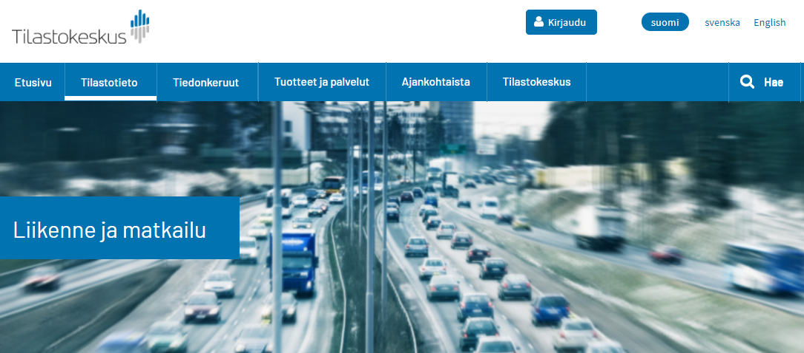
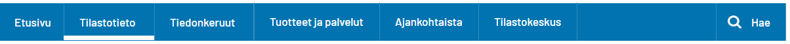

# Beta Design System <!-- omit in toc -->

## Sisällysluettelo <!-- omit in toc -->
- [Typografia](#typografia)
  - [Typografian saavutettavuus](#typografian-saavutettavuus)
- [Kuvat](#kuvat)
  - [Hero-kuva](#hero-kuva)
- [Ikonit](#ikonit)
- [Värit](#v%c3%a4rit)
- [Sivupohja](#sivupohja)
  - [Navigaatio-palkki mobiili](#navigaatio-palkki-mobiili)
    - [Menu mobiili](#menu-mobiili)
  - [Navigaatio-palkki desktop](#navigaatio-palkki-desktop)
    - [Menut desktop](#menut-desktop)
  - [Sisältöalue](#sis%c3%a4lt%c3%b6alue)
  - [Sivuston tausta](#sivuston-tausta)
  - [Tekstipalsta](#tekstipalsta)
  - [Blokit](#blokit)
  - [Footer](#footer)
- [Komponentit](#komponentit)
  - [Jakoviiva](#jakoviiva)
  - [Haitari](#haitari)
    - [Haitarin ikonien tyylit](#haitarin-ikonien-tyylit)
    - [Haitarin saavutettavuus](#haitarin-saavutettavuus)
  - [Laajennuspaneeli](#laajennuspaneeli)
  - [Linkki](#linkki)
    - [Linkkien saavutettavuus](#linkkien-saavutettavuus)
    - [Sisäinen linkki](#sis%c3%a4inen-linkki)
      - [Tavallinen linkki](#tavallinen-linkki)
      - [Negatiivi-linkki](#negatiivi-linkki)
      - [Linkki tekstin seassa](#linkki-tekstin-seassa)
      - [Linkki ikonilla](#linkki-ikonilla)
    - [Ulkoinen linkki](#ulkoinen-linkki)
  - [Murupolku](#murupolku)
  - [Painike](#painike)
    - [Koko](#koko)
    - [Ensisijainen painike](#ensisijainen-painike)
    - [Toisijainen painike](#toisijainen-painike)
    - [Kolmassijainen painike](#kolmassijainen-painike)
    - [Negatiivi-painike](#negatiivi-painike)
  - [Pudotusvalikko](#pudotusvalikko)
    - [Tavallinen pudotusvalikko](#tavallinen-pudotusvalikko)
    - [Multi select (monen valinnan)	pudotusvalikko](#multi-select-monen-valinnan-pudotusvalikko)
    - [Pudotusvalikoiden saavutettavuus](#pudotusvalikoiden-saavutettavuus)
  - [Pääkohdat](#p%c3%a4%c3%a4kohdat)
  - [Tagit](#tagit)
  - [Tilastokuviot](#tilastokuviot)
    - [Kuvioiden saavutettavuus](#kuvioiden-saavutettavuus)
    - [Kaikille kuviotyypeille yhteiset tyylit](#kaikille-kuviotyypeille-yhteiset-tyylit)
    - [Viivakuvio](#viivakuvio)
    - [Piirakkakuvio](#piirakkakuvio)
    - [Pylväskuvio](#pylv%c3%a4skuvio)
    - [Kuvion tooltip](#kuvion-tooltip)
  - [Tilastotaulukko](#tilastotaulukko)
    - [Taulukon saavutettavuus](#taulukon-saavutettavuus)
    - [Taulukko pienillä näytöillä](#taulukko-pienill%c3%a4-n%c3%a4yt%c3%b6ill%c3%a4)
    - [Taulukko isoilla näytöillä](#taulukko-isoilla-n%c3%a4yt%c3%b6ill%c3%a4)
    - [Taulukon tyylit](#taulukon-tyylit)
  - [Video](#video)
    - [Videoiden saavutettavuus](#videoiden-saavutettavuus)
    - [Koko](#koko-1)
    - [Videoelementin tyylit](#videoelementin-tyylit)

## Typografia
Fontteina käytetään Googlen ilmaisia fontteja. Vaikka osa fonttien ko'oista on tässä ilmoitettu pikseleinä, ne tulee toteuttaa suhteellisina arvoina (em tai rem). 

| Taso                | Font                     | Font-size     | Font-family                                                    | Color   |
| ------------------- | ------------------------ | ------------- | -------------------------------------------------------------- | ------- |
| Leipäteksti         | Source Sans Pro, regular | 16px/1rem     | Source Sans Pro, Arial, Verdana, Lucida, Helvetica, Sans-serif |         |
| Leipäteksti, iso    | Source Sans Pro, regular | 18px          |                                                                |         |
| H1                  | Barlow, regular          | 34px          |                                                                |         |
| H2                  | Barlow, regular          | 28px          |                                                                |         |
| H3                  | Barlow, regular          | 22px          |                                                                |         |
| H4                  | Barlow, medium           | 16px          |                                                                |         |
| H5                  | Barlow, medium           | 14px          |                                                                |         |
| Ingressi            | Barlow regular           | 17px/1.255rem |                                                                |         |
| Introteksti         | Barlow, medium           | 14px          |                                                                |         |
| Päiväys/kirjoittaja | Barlow, regular          | 14px          |                                                                |         |
| Tyyppitagit         | Barlow, semibold         | 14px          |                                                                | #333333 |

### Typografian saavutettavuus
* Fonttien koot tulee toteuttaa suhteellisina arvoina (em tai rem), jolloin käyttäjät pystyvät suurentamaan niitä halutessaan. 

## Kuvat
### Hero-kuva

Hero-kuvia käytetään aihe- ja tarkka aihe -sivujen yläosassa. Jokaisella aiheella ja tarkalla aiheella on oma kuvansa. Hero-kuviksi valitaan sellaisia, jotka toimivat monessa koossa. 

Mobiilissa hero-kuva ulottuu näytön laidasta laitaan. Mobiilinäytöllä näkyy täysikokoisesta kuvasta rajattu tietty kohta. (Kohta määritellään myöhemmin tarkemmin.) Mobiilissa sivun otsikko ja sen sininen tausta tulevat hero-kuvan alle. 

Desktopissa hero-kuva ulottuu näytön laidasta laitaan kunnes kuvan koko tulee vastaan. Sen jälkeen kuvan vasemmalle ja oikealle puolelle tulee marginaalit. Kuva-alueen korkeus pysyy samana koko ajan ja kuva rajautuu korkeudesta näytön koon kasvaessa. Desktopissa sivun otsikko ja otsikon alla oleva sininen palkki tulee kuvan päälle. 

## Ikonit

Ikoneina käytetään (jo aiemmin käytössä olleita) Font Awesomen ja IcoMoonin ilmaisia ikonikirjastoja. Linkki ikonikirjastoihin lisätään myöhemmin. 

## Värit
Väreinä käytetään Tilastokeskuksen väripalettia. Värit täydennetään tänne tai linkki niihin lisätään myöhemmin. 

## Sivupohja

### Navigaatio-palkki mobiili

Kuvaus lisätään suunnitelman valmistuttua. 

#### Menu mobiili
	
### Navigaatio-palkki desktop

| Max-width | Background-color | Sisältöalueen leveys | Sisällön tasaus |
| --------- | ---------------- | -------------------- | --------------- |
| 2500px    | #0073b0          | 1200px               | left            |

Navigaatio-palkin taustan leveys on näytön/selainikkunan laidasta laitaan 2500px asti. Siitä ylöspäin navipalkin oikealle ja vasemmalle puolelle tulee marginaalit. 
*Poikkeus:* 
Jos ollaan sivulla, jossa on bannerikuva (aiheen ja tarkennetun aiheen sivuilla): navipalkin tausta on näytön laidasta laitaan kunnes bannerikuvan rajat tulevat vastaan: navipalkki loppuu siinä missä bannerikuvakin. 

Navipalkin sisältöalue on leveydeltään 1200px eli sama kuin muukin sisältöalue. Navipalkin sisältö pysyy sisältöalueen sisällä, se ei leviä taustan mukana näytön koon kasvaessa. Navipalkin sisältö on samassa linjassa sivun muun sisällön kanssa eli alkaa vasemmassa laidassa samasta kohdasta kuin sivuston muukin sisältö. Navipalkin sisältö on tasattu vasempaan laitaan eikä siis levity tasaisesti koko navipalkin alueelle. 

| Font          | Font-size | Color   | Font-variant | Text-decoration | Padding                                                                      |
| ------------- | --------- | ------- | ------------ | --------------- | ---------------------------------------------------------------------------- |
| Barlow medium | 1.1rem    | #ffffff | normal       | none            | padding-left ja padding-right: 1.5rem, padding-top ja padding-bottom: 1.2rem |
			
Navigaatiopalkin linkkien välissä on ohuet pystyviivat. Viivojen korkeus sama kuin navipalkin korkeus: 
| Width | Color   |
| ----- | ------- |
| 1px   | #338fc0 |

Se sivuston osio, jossa kulloinkin ollaan, näkyy navigaatiopalkissa korostettuna. Korostuksen tyyli määritellään myöhemmin tarkemmin. 

#### Menut desktop
Navigaatiopalkista avautuvien menujen sisältö on tasattu vasempaan laitaan.  

### Sisältöalue

|             | Leveys | Palstoja max |
| ----------- | ------ | ------------ |
| **Desktop** | 1200px | 3            |
| **Mobiili** |        | 1            |

Sisältöalueen maksimileveys desktopissa on 1200px. Sisältöalue on jaettu desktopissa maksimissaan kolmeen palstaan ja mobiilissa yhteen palstaan. Desktopin kolme palstaa asettuvat responsiivisesti allekkain näytön/selainikkunan pienentyessä. 

### Sivuston tausta

| Background          |
| ------------------- |
| valkoinen, 2% musta |

	
### Tekstipalsta

|             | Width | Text-align |
| ----------- | ----- | ---------- |
| **Desktop** | 555px | left       |
| **Mobiili** |       | left       |

### Blokit

|             | Background-color    | Margin        | Padding                                                                                                                                |
| ----------- | ------------------- | ------------- | -------------------------------------------------------------------------------------------------------------------------------------- |
| **Desktop** | valkoinen, 2% musta | 2.5rem (40px) | 2.5rem (40px)                                                                                                                          |
| **Mobiili** | valkoinen, 2% musta | 2.5rem (40px) | **Padding-top** ja **padding-bottom**: puolet desktopin paddingista. **Padding-left** ja **padding-right**: 1/4 desktopin paddingista. |

### Footer 

| Max-width | Sisältöalueen leveys | Background-color | Palstoja max |
| --------- | -------------------- | ---------------- | ------------ |
| 2500px    | 1200px               | #0073b0          | 4            |
		
Footerin tausta ulottuu aina laidasta laitaan, sekä isoissa että pienissä näytöissä/selainikkunoissa. 
Isoissa desktop-näytöissä 2500px leveyteen asti koko näytön levyinen, siitä ylöspäin tulee marginaalit. Eli footerin tausta käyttäytyy deskarissa kuten yläpalkin ja navipalkin tausta. 
	
Footerin sisältöalue on leveydeltään 1200px eli sama kuin muukin sisältöalue.

Footerissa on neljä palstaa: ensimmäisessä Tilastokeskuksen logo, kolmessa muussa on linkkejä. Palstat käyttäytyvät responsiivisesti eli näytön/selainikkunan pienentyessä palstat hyppäävät allekkain: ensin kahteen riviin siten että kaksi ensimmäistä palstaa on samalla rivillä ja loput toisella, sitten neljään riviin eli jokainen palsta omalle rivilleen. 

## Komponentit

### Jakoviiva

Jakoviiva on kapea harmaa viiva, joka erottaa sisältöjä toisistaan. Jakoviivoja voidaan käyttää myös asioiden ryhmittelyyn asettamalla niitä eri ryhmien väliin, esim. menuissa. 

| Height | Color   |
| ------ | ------- |
| 1px    | #aaaaaa |

Ensisijaisesti eri osioiden erottamiseen toisistaan tulee käyttää tyhjää tilaa. Niissä tilasteissa, joissa tyhjää tilaa ei voida käyttää tai se ei ole riittävä tapa, käytetään jakoviivoja.  

Jakoviivoilla voidaan myös erottaa saman kokonaisuuden tai toisiinsa liittyviä elementtejä toisistaan. 

### Haitari 

Haitari-elementissä piilotetaan sisältöä otsikoiden alle. Haitarit auttavat hahmottamaan laajoja kokonaisuuksia ja niillä saadaan lyhennetty sivun pituutta. Otsikoita klikkaamalla piilotettua sisältöä saa näkyviin ja taas pois näkyvistä. 

Haitarit ovat oletusarvoisesti suljettuja. Käyttäjä voi avata ja sulkea niiden osioita haluamassaan järjestyksessä. Useita haitarin osia voi olla avattuna auki samaan aikaan. 

Haitari on enintään kaksi tasoa syvä. Sisempi taso on sisennetty ensimmäisen tason alla, tällä viestitään haitarin hierarkista rakennetta. 

Suljettujen osien otsikoiden vasemmalla puolella on plus-ikoni. Kun osio avataan, plus-ikoni muuttuu miinus-ikoniksi. Avatun osion alle tulee jakoviiva. 

#### Haitarin ikonien tyylit
Haitarin ensimmäisellä tasolla plus- ja miinus-ikonit ovat suurempia ja tummempia kuin syvemmällä tasolla, jossa ne ovat pienempiä ja vaaleampia. Myös tällä kerrotaan visuaalisesti hierarkiasta. 

| Hierarkiataso | Height | Width | Color    |
| ------------- | ------ | ----- | -------- |
| Ensimmäinen   | 15px   | 15px  | #0073b0  |
| Toinen        | 11px   | 11px  | #338FC0F |

#### Haitarin saavutettavuus
* Kaikki käyttäjät eivät välttämättä huomaa haitari-elementtiä tai ymmärrä miten se toimii. Siksi haitariin ei pidä laittaa sellaista sisältöä, joka on käyttäjälle tärkeää huomata tai löytää. 
* Haitarin sisällön tulee muodostaa yhtenäinen kokonaisuus. 
* Ruudunlukijalle tulee kertoa onko haitarin kohta auki vai kiinni. 

### Laajennuspaneeli 
(Eng. expansion panel)

Esim. Videon käsikirjoitus -laajennuspaneeli

Tyylit täydennetään kun elementti on saatu käsiteltyä. 
	
### Linkki

Linkkejä käytetään navigaatiossa sivuston sisällä sekä navigoinnissa ulkoisiin sivustoihin ja palveluihin. 

#### Linkkien saavutettavuus
* Yleisiä Katso lisää -tyylisiä linkkejä on hyvä välttää. Linkin tekstin tulee olla mahdollisimman tarkoitustaan tai kohdesivuaan kuvaava. 
* Linkkien tekstien tulee olla mahdollisimman paljon kohdesivun otsikkoa vastaavia. 
* Jos linkki vie toiselle sivustolle tai avaa tiedoston, on tämä käytävä linkistä ilmi sekä ruudunlukijaa käyttäville että näkeville käyttäjille. Näkeviä käyttäjiä varten linkin yhteyteen lisätään myös ulkoisen linkin ikoni ja ruudunlukijaa varten (mikä?). 
* Linkkien tyylit on pidettävä yhtenäisinä. Navigaatiolinkit ovat poikkeus tästä, niillä on omat tyylinsä. 
* Kaikki linkit toimivat näppäimistökäytössä vain enterillä. 

#### Sisäinen linkki

##### Tavallinen linkki

 Tavallisissa tekstistä erillään olevissa linkeissä on alleviivaus vain hover- ja focus-tilassa. 

| Tila           | Font        | Text-decoration | Color   | Muuta                                 |
| -------------- | ----------- | --------------- | ------- | ------------------------------------- |
| **Tavallinen** | Leipäteksti | none            | #006ca5 |                                       |
| **Hover**      |             | underline       | #0039a6 | Kursori muuttuu kädeksi linkin päällä |
| **Focus**      |             | underline       | #0039a6 | Reunus: 2px, #0073b0                  |
| **Vierailtu**  |             | none            | #551a8b |                                       |

Tavallinen-tila:

Hover-tila:

Focus-tila:

Vierailtu-tila:

##### Negatiivi-linkki

Negatiivi-linkki on linkki tummalla taustalla. Tumman taustan vuoksi sen tyylit eri tiloissa hieman eroavat tavallisesta linkistä. 

| Tila           | Font        | Text-decoration | Color   | Muuta                                 |
| -------------- | ----------- | --------------- | ------- | ------------------------------------- |
| **Tavallinen** | Leipäteksti | none            | #ffffff |                                       |
| **Hover**      |             | underline       | #ffffff | Kursori muuttuu kädeksi linkin päällä |
| **Focus**      |             | underline       | #ffffff | Reunus: 2px, #ffffff                  |
| **Vierailtu**  |             | none            | #ffffff |                                       |

Tavallinen-tila:

Hover-tila:

Focus-tila:

Vierailtu-tila:

##### Linkki tekstin seassa

Tekstin seassa, eli p-elementin sisällä, olevat linkit alleviivataan aina. Muissa linkeissä on alleviivaus vain hover- ja focus-tilassa. 

| Tila           | Font        | Text-decoration | Color   | Muuta                                 |
| -------------- | ----------- | --------------- | ------- | ------------------------------------- |
| **Tavallinen** | Leipäteksti | underline       | #006ca5 |                                       |
| **Hover**      |             | underline       | #0039a6 | Kursori muuttuu kädeksi linkin päällä |
| **Focus**      |             | underline       | #0039a6 | Reunus: 2px, #0073b0                  |
| **Vierailtu**  |             | underline       | #551a8b |                                       |

##### Linkki ikonilla

Ikoneja voidaan käyttää linkkien osana helpottamaan linkin tunnistamista tai huomaamista. 

Ikoni tulee linkin eteen (poikkeuksena ulkoinen linkki, jossa ikoni tulee tekstin jälkeen) ja on samanvärinen kuin linkin teksti. Ikoni on osa linkkiä. 

Yksittäisessä erillään olevassa linkissä linkin perässä oleva nuoli korostaa, että linkistä tapahtuu jotain. Nuoli on aina linkin perässä. Nuoli-ikoni ei ole osa linkkiä, siitä klikkaamalla ei tapahdu mitään. 

Linkeillä voi olla myös kaksi ikonia. Ikonit asettuvat silloin linkkitekstin molemmille puolille. 

Linkkien ikonien tyylit:

| Ikoni                         | Color   |
| ----------------------------- | ------- |
| **Nuoli**                     | #000000 |
| **StatFin/database**          | #f59a23 |
| **Muut ikonit**               | #0073b0 |
| **Negatiivi-linkkien ikonit** | #ffffff |

#### Ulkoinen linkki

Ulkoisen linkin tekstissä tulee käydä ilmi, että linkki vie toiseen sivustoon tai palveluun. Linkkitekstin perässä on ulkoisen linkin ikoni, joka on osa linkkiä. 

### Murupolku

 Viimeistä osaa lukuunottamatta murupolun osat ovat linkkejä. Murupolkun linkkiosat käyttäytyvät kuten tavalliset linkit kaikkine eri tiloineen. Murupolun fonttina on H5-otsikkotason fontti. Vaikka murupolku noudattaa H5-tason fonttia, se ei ole semanttisesti H5-tason otsikko vaan navigaatio-elementti. 

 Osiot erotetaan toisistaan /-merkillä. 

| Murupolun osa | Font           | Font-size | Color   | Muuta                                  |
| ------------- | -------------- | --------- | ------- | -------------------------------------- |
| Linkki        | Barlow, medium | 14px      | #006ca5 | samat tilat kuin tavallisella linkillä |
| Viimeinen     | Barlow, medium | 14px      | #000000 | ei linkki                              |

Murupolku käyttäytyy desktopissa ja mobiilissa hieman eri tavoin. 

**Murupolku desktopissa**

Desktopissa näytetään murupolussa kaikki tasot: 

Murupolun viimeinen kohta ei ole linkki. 
	
**Murupolku mobiilissa**

Mobiilissa matalilla sivuston hierarkian tasoilla (n. kaksi ensimmäistä tasoa) näytetään normaali murupolku: 

Syvämmällä hierarkian tasoilla murupolussa näytetään vain linkki yhtä tasoa hierarkiassa ylemmäs. Näin estetään murupolun rivittyminen mobiilissa. Esim. tilastojulkistus-sivun murupolussa näkyy vain linkki tilaston sivulle:

|                                             | Murupolun muoto                                                    |
| ------------------------------------------- | ------------------------------------------------------------------ |
| **Desktop**                                 | Tilastotieto / Suomalaisten matkailu / Tilastojulkistus / Taulukko |
| **Mobiili (matalilla hierarkian tasoilla)** | Tilastotieto / Suomalaisten matkailu                               |
| **Mobiili (syvillä hierarkian tasoilla)**   | < Tilastojulkistus                                                 |

### Painike

#### Koko

Mobiilissa painikkeet ovat täysleveitä lukuunottamatta niiden oikealle ja vasemmalle puolelle jääviä marginaaleja. Isoilla näytöillä eli desktopissa painikkeiden leveys taas skaalautuu sisällön mukaan. Minimi-leveys painikkeille on kuitenkin 80px. 

**Painikkeiden yhteiset ominaisuudet**
| Font                     | Font-size | Border-radius | Min-width | Min-height | Focus-kehys  |
| ------------------------ | --------- | ------------- | --------- | ---------- | ------------ |
| Source Sans Pro, regular | 16px/1rem | 5px           | 80px      | 40px       | 2px, #0073b0 |

#### Ensisijainen painike

| Tila                 | Color   | Background-color | Border | Box-shadow                              |
| -------------------- | ------- | ---------------- | ------ | --------------------------------------- |
| **Tavallinen**       | #ffffff | #0073b0          | -      | 2px, 2px, 5px, rgba(102,102,102,0.35)   |
| **Selected/pressed** | #ffffff | #0073b0          | -      | 2px, 2px, 5px, rgba(5,3,112,0.35) inset |
| **Disabled**         | #666666 | #f2f2f2          | -      | 2px, 2px, 5px, rgba(102,102,102,0.35)   |
| **Hover**            | #ffffff | #338fc0          | -      | 2px, 2px, 5px, rgba(102,102,102,0.35)   |
| **Focus**            | #ffffff | #338fc0          | -      | 2px, 2px, 5px, rgba(102,102,102,0.35)   |

#### Toisijainen painike

| Tila                 | Color   | Background-color | Border  | Box-shadow                                  |
| -------------------- | ------- | ---------------- | ------- | ------------------------------------------- |
| **Tavallinen**       | #0073b0 | #ffffff          | #0073b0 | 2px, 2px, 5px, rgba(102,102,102,0.35)       |
| **Selected/pressed** | #0073b0 | #ffffff          | #0073b0 | 2px, 2px, 5px, rgba(102,102,102,0.35) inset |
| **Disabled**         | #7f7f7f | #ffffff          | #aaaaaa | 2px, 2px, 5px, rgba(102,102,102,0.35)       |
| **Hover**            | #0073b0 | #f2f2f2          | #0073b0 | 2px, 2px, 5px, rgba(102,102,102,0.35)       |
| **Focus**            | #0073b0 | #f2f2f2          | #0073b0 | 2px, 2px, 5px, rgba(102,102,102,0.35)       |

#### Kolmassijainen painike

| Tila                 | Color   | Background-color | Border | Box-shadow                                  |
| -------------------- | ------- | ---------------- | ------ | ------------------------------------------- |
| **Tavallinen**       | #0073b0 | #f2f8fb          | -      | 2px, 2px, 5px, rgba(102,102,102,0.35)       |
| **Selected/pressed** | #0073b0 | #f2f8fb          | -      | 2px, 2px, 5px, rgba(102,102,102,0.35) inset |
| **Disabled**         | #666666 | #f2f2f2          | -      | 2px, 2px, 5px, rgba(102,102,102,0.35)       |
| **Hover**            | #000000 | #f2f8fb          | -      | 2px, 2px, 5px, rgba(102,102,102,0.35)       |
| **Focus**            | #000000 | #f2f8fb          | -      | 2px, 2px, 5px, rgba(102,102,102,0.35)       |

#### Negatiivi-painike

| Tila                 | Color   | Background-color | Border  | Box-shadow                                  |
| -------------------- | ------- | ---------------- | ------- | ------------------------------------------- |
| **Tavallinen**       | #0073b0 | #ffffff          | #0073b0 | 4px, 4px, 5px, rgba(85,85,85,0.35)          |
| **Selected/pressed** | #0073b0 | #ffffff          | #0073b0 | 2px, 2px, 5px, rgba(102,102,102,0.35) inset |
| **Disabled**         | #7f7f7f | #ffffff          | #aaaaaa | 4px, 4px, 5px, rgba(85,85,85,0.35)          |
| **Hover**            | #0073b0 | #f2f2f2          | #0073b0 | 4px, 4px, 5px, rgba(85,85,85,0.35)          |
| **Focus**            | ?       | ?                | ?       | ?                                           |

### Pudotusvalikko
(Eng. dropdown)

Pudotusvalikko on elementti, jonka tarjoamista vaihtoehdoista valitaan yksi tai useampi. 

Pudotusvalikoita on kahdenlaisia:
1.  tavallinen pudotusvalikko: pudotusvalikon vaihtoehdoista valitaan yksi. 
2.  multi select: pudotusvalikon vaihtoehdoista voidaan valita useita. 

Mobiili-käyttöliittymissä käytetään käyttöjärjestelmien valmiita pudotusvalikkojen toteutusratkaisuja. Desktop-käyttöliittymiin pudotusvalikot toteutetaan itse. Seuraavaksi käydään läpi pudotusvalikkojen design desktop-käyttöliittymissä. 

#### Tavallinen pudotusvalikko

Tavallisessa pudotusvalikossa voi tehdä vain yhden valinnan. 

Jokaisen pudotusvalikon yllä on valikon nimike eli label, joka kertoo lyhyesti mitä pudotusvalikko sisältää. Pudotusvalikon kentässä näkyy mikä valikon vaihtoehdoista on valittuna. Valikon kenttää klikkaamalla valikko avautuu ja vaihtoehdot tulevat näkyviin. 

Valittu vaihtoehto näkyy paitsi pudotusvalikon kentässä myös  valikossa korostettuna. Oletuksena tavallisessa pudotusvalikossa on valittuna Kaikki xxx -valinta, joka on listassa heti ensimmäisenä (tekstin muoto riippuu pudotusvalikon sisällöstä ja labelista). Valintatoiminto sulkee valikon. 

Jos pudotusvalikossa vaihtoehtoja on yli 14, valikko ei veny pituutta vaan siitä tulee pystysuunnassa vieritettävä. Valikon oikeaan laitaan tulee näkyviin scrollbar. 

Jos vaihtoehtoja on yli 20, valikon sisään on hyvä lisätä hakutoiminnallisuus ja hakukenttä. Näin käyttäjät voivat hakea pitkästäkin valikosta haluamaansa vaihtoehtoa nopeasti. Hakukentän paikka avatussa valikossa on heti ylhäällä ennen valikon vaihtoehtoja. 

#### Multi select (monen valinnan)	pudotusvalikko

Multi select -pudotusvalikosta voidaan valita yksi tai useampi tarjolla olevista vaihtoehdoista.

 Avatussa valikossa vaihtoehtojen vasemmalla puolella on checkbox-valintaruutu. Kun vaihtoehto on valittu, valintaruutuun ilmestyy täppä ja valitun vaihtoehdon tausta korostetaan. Valinnan voi poistaa klikkaamalla vaihtoehtoa uudestaan. 

Kun vain yksi vaihtoehto on valittuna, pudotusvalikon kentässä näkyy kyseinen valinta, esim. Kaikki aiheet. Kun on valittu useampia vaihtoehtoja, kentässä näkyy valintojen lukumäärä, esim. 2 valittu. 

Pudotusvalikossa on oletuksena valittuna ensimmäisenä oleva Kaikki xxx eli esim. Kaikki aiheet (teksti riippuu pudotusvalikon sisällöstä ja labelista). Kun jokin muu vaihtoehto valitaan, poistuu Kaikki xxx -valinta. Jos valinnat otetaan pois kaikista muista vaihtoehdoista, Kaikki xxx -valinta menee automaattisesti päälle. 

#### Pudotusvalikoiden saavutettavuus

* Pudotusvalikon yläpuolella on sen nimike eli label. Label kertoo lyhyesti mitä pudotusvalikko sisältää. 
* Ruudunlukijaa käyttäville kerrotaan pudotusvalikon status eli onko valikko kiinni vai auki. 
* Ruudunlukijaa käyttäville kerrotaan myös mikä tai mitkä valikon valinnoista on valittuna.

### Pääkohdat

Pääkohdat-elementissä kerrotaan tiiviisti tilastojulkistuksen tärkeimmät asiat. Elementtiin kerätään max 5 asiaa. Pääkohdat-elementti sijaitsee tilastojulkistuksessa ingressin alla. 

|                   | Font            | Font-size     | Color   |
| ----------------- | --------------- | ------------- | ------- |
| Otsikko (H2)      | Barlow, regular | 28px          | #00B2A9 |
| Teksti (Ingressi) | Barlow, regular | 17px/1.255rem | #000000 |

Tekstin sisennys: riippuva sisennys eli teksti sisentyy palleron oikealle puolelle, kaikki tekstirivit samassa linjassa. 

|                  | Color   | Muuta             |
| ---------------- | ------- | ----------------- |
| Pallot           | #00B2A9 |                   |
| Vasen pystyviiva | #00B2A9 | ei ole mobiilissa |

### Tagit

Tageja käytetään antamaan julkaisuista lisää tietoa. Ne sijaitsevat otsikon yläpuolella tilastojen ja julkaisujen sivuilla sekä julkaisujen nostoelementeissä. 

Tagit antavat lisätietoa julkaisun ja sivun: 
* sisältötyypistä: tilasto, tilastojulkistus, taulukko, kuvio, indikaattori, artikkeli, blogi, video, katsaus, muutoksia tässä tilastossa, jne.   
* mihin tilastoon julkaisu kuuluu,
* mitä viiteajankohtaa tilastojulkistus käsittelee, 
* mikä on tilastojulkistuksen status: ennakko, pikaennakko, lopullinen jne. 
* mihin domainiin/palveluun julkaisu kuuluu, jos se kuuluu muuhun kuin stat.fi-domainiin: Findikaattori, Tieto&trendit. 
 
Huom! Tageilla ei merkitä julkaisupäivämäärää, sitä varten on oma elementtinsä. 

Tageja voi olla julkaisujen nostoelementeissä useampi peräkkäin. Esimerkiksi tilastojulkistuksen nostoelementissä on julkaisun tyyppi, tilasto, viiteajankohta ja julkaisun status. Julkaisun sisältötyyppi erotetaan muista tageista |-merkillä. 

Julkaisujen sivuilla on vain sivun sisältötyyppi-tagi, esimerkiksi tilastojulkistuksen sivulla Tilastojulkistus. Muita tageja ei ole tarpeen toistaa, sillä niiden tiedot esitetään sivulla muissa kohdissa. 

Silloin kun nostoelementtien linkki vie ulkoiseen palveluun, käytetään ulkoisen linkin ikonia tagissa mukana. Ulkoisen linkin ikoni laitetaan domainin nimen perään. 

**Tagien tyyli** 

|                        | Font             | Font-size | Color   |
| ---------------------- | ---------------- | --------- | ------- |
| Tagit                  | Barlow, semibold | 14px      | #333333 |
| Ulkoinen linkki -ikoni |                  |           | #333333 |

### Tilastokuviot

#### Kuvioiden saavutettavuus

* Suositus on, että kuvioon ei laiteta liikaa sisältöä. Tällöin kuvio pysyy helpommin ymmärrettävänä ja värisävyjen kontrastit riittävät harmaan sävyisinäkin (täyden värisokeuden tapaus). Jos sisältöä on paljon, on parempi jakaa sisältö useaan eri kuvioon. 

* Tilastokuviot piilotetaan ruudunlukijalta. Tällöin ruudunlukija ei lue kuvioiden otsikoitakaan. Näin toimitaan, koska kuvioita on niin paljon, että tekstivastineita (alt-tekstiä) ei ole mahdollista tehdä niille kaikille. Kuvioiden sisältö tulee kuitenkin tarjota sivulla tekstimuodossa, jotta myös ruudunlukijaa käyttävät saavat kuvioiden sisältämän informaation. 

* Tilastokuvioissa viivat, pylväät ja piirakan siivut erotetaan toisistaan väreillä. Tämä saavutettavuusrajoite tulee mainita saavutettavuusselosteessa. Tilastokuvioissa ei siis käytetä reunaviivoja, paksuuseroja, eri muotoja tai pintakuviointeja osioiden erottamiseksi toisistaan. 

#### Kaikille kuviotyypeille yhteiset tyylit

**Fontit**

|                | Font                          | Font-size   | Text-align |
| -------------- | ----------------------------- | ----------- | ---------- |
| **Otsikko**    | Barlow Semi Condensed medium  | 1rem (16px) | center     |
| **Alaotsikko** | Barlow Semi Condensed regular | 1rem (16px) | center     |
| **Muu teksti** | Barlow Semi Condensed regular | 1rem (16px) |            |

**Hilaviivat**

| Color   | Width  |
| ------- | ------ |
| #666666 | 0.25px |

**Akselit**

|              | Color   | Width | Akselin otsikon sijainti                   |
| ------------ | ------- | ----- | ------------------------------------------ |
| **y-akseli** | #666666 | 0.5px | Akseliviivan keskellä, eli nykyinen paikka |
| **x-akseli** | #666666 | 0.5px | Akseliviivan keskellä, eli nykyinen paikka |

#### Viivakuvio

Viivojen selitteet sijaitsevat kuvion alla. Näin saadaan niille enemmän tilaa, sillä selitetekstit voivat olla pitkiä. 

|            | Width |
| ---------- | ----- |
| **Viivat** | 3px   |

#### Piirakkakuvio

(Tähän kuva piirakkakuviosta.)

Piirakkakuvioissa lukuarvot sijaitsevat piirakan ulkopuolella ja on luku yhdistetty viivalla piirakan viipaleeseen (tämä on jo ennestään käytössä oleva malli). 

Piirakoissa selitetekstien järjestys on laskeva suuruusjärjestys. 

#### Pylväskuvio

(Tähän kuva pylväskuviosta.)

Pylväskuvioissa selitetekstit ovat järjestyksessä palkkien mukaan eli alhaalta ylös. 

#### Kuvion tooltip

Kuvion tooltip on pieni laatikko, joka tulee näkyviin kuvion päälle ja kertoo tietyn datapisteen arvon. Tooltip ilmestyy näkyviin hover-toiminnolla eli kursorin osuessa kuvion kohtaan, josta datapisteen arvo on saatavissa. Tooltip kertoo muuttujan nimen, arvon labelin ja lopullisen datapisteen arvon. 

| Font                          | Font-size   | Background-color | Border  | Box-shadow                            |
| ----------------------------- | ----------- | ---------------- | ------- | ------------------------------------- |
| Barlow Semi Condensed regular | 1rem (16px) | #f2f8fb          | #0073b0 | 2px, 2px, 5px, rgba(102,102,102,0.35) |

### Tilastotaulukko

#### Taulukon saavutettavuus
* Taulukkoon ei tule laittaa liikaa sisältöä. Näin taulukot pysyvät helpommin ymmärrettävinä ja vertailtavina. Jos sisältöä on paljon, on parempi jakaa sisältö useaan eri taulukkoon. 
* Taulukoissa ei tulisi olla todella paljon sarakkeita ja/tai rivejä. Tämä helpottaa taulukoiden käyttöä ja ymmärrettävyyttä, erityisesti mobiililaitteilla. 
* Sarake- ja riviotsikkojen tulee olla mahdollisimman lyhyitä ja ytimekkäitä. Liian pitkiä sarake- ja riviotsikoita tulee välttää. Tämä auttaa taulukoita asettumaan paremmin mobiililaitteissa. 
* Jos on tarpeen tehdä hierarkisia taulukoita, on suositeltavaa käyttää korkeintaan kahta hierarkian tasoa. Myös tämä auttaa taulukon ymmärrettävyyttä. 

#### Taulukko pienillä näytöillä

Vaikka taulukot yritetään pitää järkevän kokoisina, voi silti käydä niin, että taulukosta tulee niin leveä tai pitkä, että se ei mahdu pienille näytöille kokonaan. Tällöin taulukon rivi- tai sarakeotsikot voidaan "jäädyttää" paikoilleen. 

Jos taulukko on näyttöä leveämpi, taulukon riviotsikot "jäädytetään" paikalleen ja muu taulukko on liikuteltavissa oikealle ja vasemmalle. Riviotsikot vievät n. 30% näytön leveydestä. Scrollbarit taulukon liikutettavan osan yllä ja alla vihjaavat tästä liikuteltavuudesta. Taulukkoa voi liikutella scrollbarien lisäksi myös itse taulukon liikuteltavaan osaan (muu kuin riviotsikot-sarake) koskemalla.
 
Jos taulukko on näyttöä pidempi, taulukon sarakeotsikot voidaan jäädyttää paikoilleen. Kun sivua vieritetään taulukon kohdalta alaspäin, taulukon sarakeotsikot jäävät näkyviin näytön yläreunaan ja muuta taulukkoa voidaan liikuttaa pystysuunnassa. Kun on päästy taulukon loppuun ja jatketaan sivun vieritystä edelleen alaspäin, sarakeotsikot katoavat näytön yläreunasta näkyvistä muun taulukon mukana. 

Sekä rivi- että sarakeotsikot eivät voi olla samaan aikaan jäädytetyt. Riippuu taulukosta, kummat otsikot kannattaa jäädyttää mobiililaitteissa ja pienissä näytöissä. 

#### Taulukko isoilla näytöillä

Taulukoiden tulee desktop-laitteilla mahtua leveydeltään sivuston sisältöalueeseen, joka on leveydeltään 1200px. 

Vain hyvin poikkeuksellisissa tilanteissa, joissa tämä ei onnistu eikä taulukkoa saada muokattua sisältöalueeseen mahtuvaksi, taulukko käyttäytyy desktop-laitteilla kuten mobiilissa. Näissä tapauksissa siis taulukon riviotsikot jäädytetään ja taulukon muuta osaa pystyy liikuttamaan vaakasuunnassa scrollbareja liikuttamalla. Taulukon liikutettavan osan ylä- ja alapuolelle tulevat scrollbarit.

Taulukoiden sisällön, rivien ja sarakkeiden määrän pitäminen maltillisena auttaa taulukoita myös pysymään sisältöalueen (1200px leveys) sisällä desktop-koossa. Tällöin ne eivät tarvitse desktop-laitteilla jäädytettyjä riviotsikoita ja vaakasuuntaista vieritysominaisuutta.  

#### Taulukon tyylit

**Taulukko**

|                            | Background-color | Border  | Border-width                         | Padding                          |
| -------------------------- | ---------------- | ------- | ------------------------------------ | -------------------------------- |
| **Taulukko**               |                  | #0073b0 | top/bottom: 0,5px left/right: 0,25px | top/bottom: 8px left/right: 10px |
| **Rivi- ja sarakeotsikot** | #f2f8fb          | #0073b0 | 0,5px                                | top/bottom: 8px left/right: 10px |
| **Solu**                   | #ffffff          | #0073b0 | 0,25px                               | top/bottom: 8px left/right: 10px |
| **Rivin hover**            | #cce3fe          |         |                                      |                                  |

**Fontit**
|                        | Font                           | Font-size                         | Text-align | Vertical-align |
| ---------------------- | ------------------------------ | --------------------------------- | ---------- | -------------- |
| Otsikko                | Barlow Semi Condensed regular  | 1rem (16px)                       |            |                |
| Sarake- ja riviotsikot | Barlow Semi Condensed SemiBold | 1rem (16px)                       | left       |                |
| Solut                  | Barlow Semi Condensed regular  | 0.9rem (15px) tai 0.875rem (14px) | right      | bottom         |

### Video

Tilastojulkistuksiin voidaan liittää videoelementti. Videoelementti on erotettu muusta sisällöstä harmaalla taustalla. Elementti koostuu taustan lisäksi sisältötyyppi- sekä tilaston nimi ja viiteajankohta -tageista, videon otsikosta, videon julkaisupäivämäärästä, linkistä Youtube-palveluun, itse videosta ja videon käsikirjoituksesta. Videon käsikirjoitus on saatavilla videon alla laajennuspaneelissa. 

#### Videoiden saavutettavuus

* Videoissa, joissa on puhetta tulee olla tekstitys. 
* (Kuvailutulkkaus ja sen tekstitys?) 
* Videon yhteydessä on tarjottava linkki Youtube-palveluun, jossa videon voi myös katsoa. 
* Videon käsikirjoitus tulee olla saatavissa. Sille on paikka videon alla käsikirjoitus-laajennuspaneelissa. 

#### Koko

 Pienillä näytöillä videoelementin osat asettuvat allekkain. Järjestys ylhäältä alas on: sisältötyyppi- sekä tilaston nimi ja viiteajankohta -tagit, videon otsikko, videon julkaisupäivämäärä, linkki Youtube-palveluun, videosta ja videon käsikirjoitus.

Isoilla näytöillä tekstiosat ja video asettuvat vierekkäin. Tagit, otsikko, julkaisupäivämäärä ja linkki Youtubeen ovat vasemmalla ja vievät 50% koko elementin leveydestä, video oikealla ja vie 50% leveydestä. Käsikirjoitus-laajennuspaneeli näiden alla 100% leveänä. Kun sivua käytetään ruudunlukijalla tai näppäimistöllä, elementtien järjestys (ts. fokuksen ja ruudunlukijan etenemisjärjestys) on sama kuin mobiilissa eli Youtube-linkin jälkeen tulee video ja videon jälkeen käsikirjoitus-laajennuspaneeli. 

#### Videoelementin tyylit

| Background-color |
| ---------------- |
| #f2f2f2          |

| Videoelementin osa | Noudattaa tyyliä        |
| ------------------ | ----------------------- |
| Tagi               | tagin tyyli             |
| Otsikko            | H3                      |
| Julkaisupäivämäärä | päiväyksen tyyli        |
| Youtube-linkki     | linkin tyyli            |
| Käsikirjoitus      | laajennuspaneelin tyyli |

	

